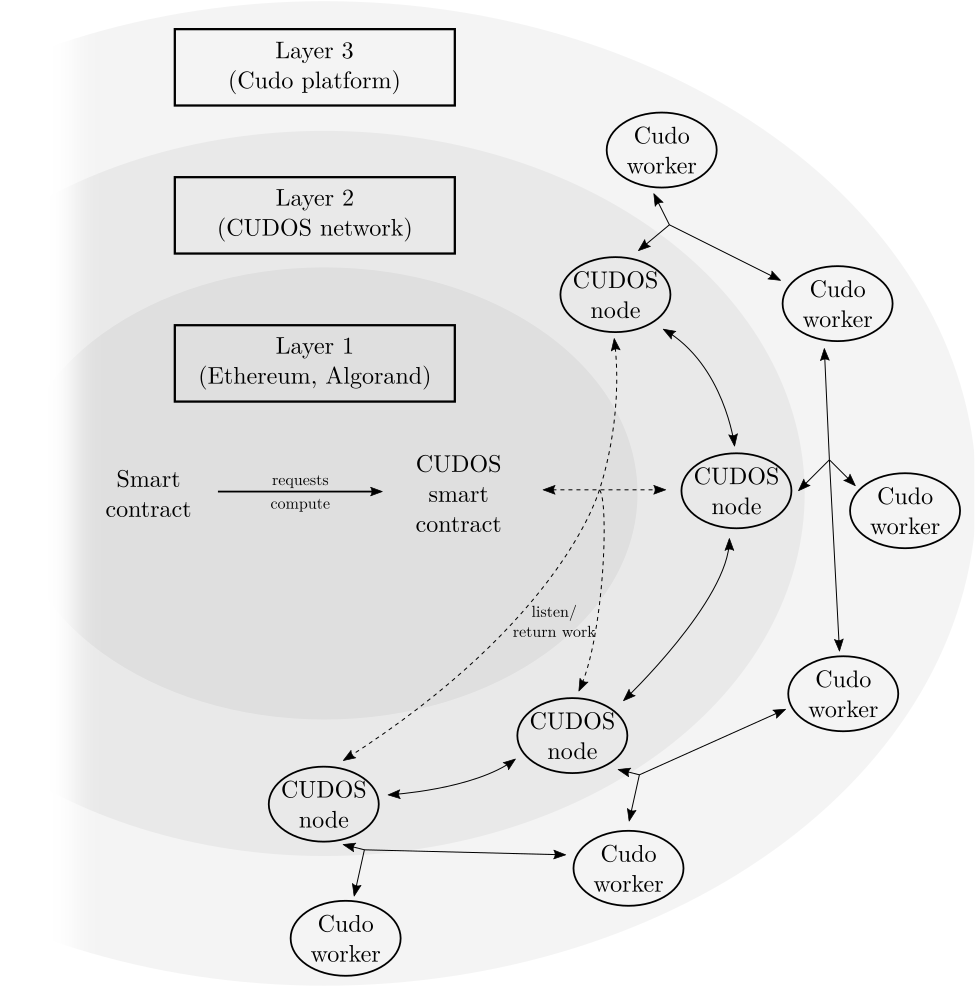

# Build

## How to build on CUDOS

Please get in touch with us using [this application form](https://www.cudos.org/#contact-us) if you’re interested in building on the CUDOS network.

### CUDOS layer 2 network

The CUDOS network is a layer 2 solution for blockchains which require extra compute or external data. Blockchains like Ethereum have very high gas costs, which make impractical running complex workloads on them. Other blockchains like Algorand need a layer 2 solution in order to add extra functionality to the platform, through a Turing-complete network that also provides external data.

This work runs on the CUDOS validator nodes. These nodes are constantly listening to events in the CUDOS smart contract, to see when a new request for a compute job is created. They ingest this request, and once they decide that they have been selected to run the work, that
triggers its WebAssembly executor part. Once execution starts, the node will fetch the passed inputs, and will send the relevant API requests to the marketplace and the app in order to run the compute workload.

### Cudo Layer 3 Network

While the CUDOS network provides a layer 2 to blockchains, Cudo Ventures is going one step further, by seamlessly integrating this technology with the Cudo platform, which can effectively be understood as blockchain’s layer 3. The Cudo platform provides cloud-like services, focusing on low costs, low latency and a high degree of personalisation. Hence, just like the CUDOS network is a layer added on top of blockchains to provide extra compute capacity, the Cudo platform can be seen as an extra layer on top of the CUDOS network, to provide even more on-demand compute capacity. This added capacity might be needed in order to select different types of hardware, or to request jobs that demand more resources than the CUDOS network can directly absorb.

As such, the CUDOS smart contracts will provide access to the CUDOS layer 2 and the Cudo layer 3, in order to run any kind of workload on any kind of supported hardware, for as long as needed. This integration takes blockchains a step further into mass-adoption, as there will be no limit in the kind of workloads that can be requested through an on-chain smart contract.

## WebAssembly (Wasm)

### What is WebAssembly?

WebAssembly (or Wasm for short) is a binary instruction format for a stack-based virtual machine. Wasm is designed as a portable compilation target for programming languages, enabling deployment on the web for client and server applications.

### Why Web Assembly?

WebAssembly became a W3C recommendation on 5 December 2019 and, alongside HTML, CSS, and JavaScript, is the fourth language to run natively in browsers. This has massive implications for the web, as it provides a way to run code written in multiple languages on the web, almost at native speed.

### What languages are supported

CUDOS will support all the standard languages that can be compiled, with an initial focus on C++ and Rust. Please do [get in touch](https://www.cudos.org/#contact-us) with us if you are interested in building dapps for CUDOS.

### Resources

- [WebAssembly main site](https://webassembly.org/)
- [MDN web docs](https://developer.mozilla.org/en-US/docs/WebAssembly)

## Supported blockchains

Initially CUDOS will be going live with integration with Ethereum and Algorand. With others to
follow shortly after including Polkadot and Cosmos.