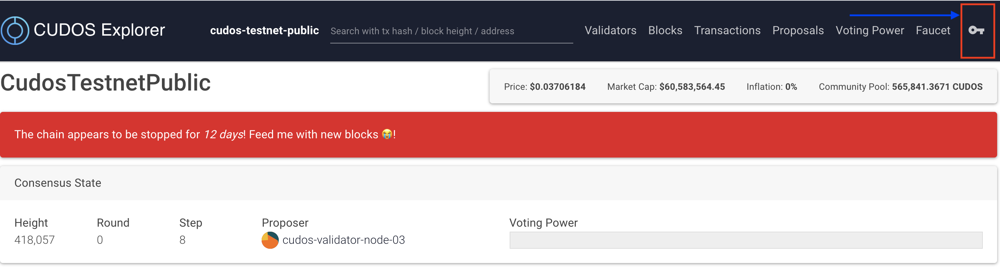

# Creating a Keplr Wallet

[Keplr](https://wallet.keplr.app/#/dashboard) is an open-sourced browser extension wallet Keplr that supports the Cudos interchain ecosystem. It provides functionalities for account and wallet management.

This article explains the Keplr extension and how to install it.

## What is Keplr

[Keplr extension](https://chrome.google.com/webstore/detail/keplr/dmkamcknogkgcdfhhbddcghachkejeap?hl=en) is supported only on Chrome. It can also be used on Brave, but some features may be unavailable. You can not use the Keplr extension from your mobile. Please note that anyone with your mnemonic seed can take your assets and any lost mnemonic seed can not be recovered.

Keplr can easily connect to libraries and simplify the process of connecting webpages to blockchains. The keplr extension supports transfers/staking for:

- Kava
- Secret Network
- Akash
- Starname
- Sifchain
- CertiK
- IRISnet
- Regen Network (Coming March 31)
- Cyber (beta)
- Straightedge (beta)

## Installing Keplr

Use Keplr extension to create a wallet:
1. Install the [Keplr extension](https://chrome.google.com/webstore/detail/keplr/dmkamcknogkgcdfhhbddcghachkejeap?hl=en)
2. Click on the installed Keplr extension that will prompt the following page in your browser:

3. Either create a new account or import an already existing account with the mnemonic phrase that you got from the previous step of creating an account. Note that currently the wallet is not connected to the cudos-network, so it will not show the correct info for that account on the cudos-network.
4. You can use the wallet to get the address to wire tokens to your account by clicking on the upper side of the extension window.

## Link Keplr to the Cudos-network

1. Go to the [Cudos Explorer](https://explorer.cudos.org) to link the Keplr extension to the Cudos network
2. Click the "key icon” in the upper right corner (used for login):

3. This will prompt a window asking you for permission to add a new network to Keplr and also give access to it:

4. After you approve, you need to open the extension and click on the network name on the upper side of it. From there a menu with all the networks will open and you should select the **CudosTestnetPublic**. After that, Keplr should visualize the correct information about your account:

## Resources

- [Full Guide on How to use Keplr Wallet](https://medium.com/chainapsis/how-to-use-keplr-wallet-40afc80907f6)
- [Keplr Documentation](https://docs.keplr.app/)
- [Introducing Keplr](https://medium.com/everett-protocol/introducing-keplr-an-interchain-wallet-for-cosmos-applications-a260aac64eaa)
- [Keplr FAQ](https://faq.keplr.app/)
