# Interact with Keplr wallet and Cudos Explorer

This article explains the following:

* [How to send tokens to another wallet](/build/interact-keplr-explorer.html#send-tokens-to-another-wallet)
* [How to delegate tokens to a validator](/build/interact-keplr-explorer.html#delegate-tokens-to-a-validator-using-cudos-explorer)
* [How to claim your rewards](/build/interact-keplr-explorer.html#claim-rewards-using-cudos-explorer)
* [How to unstake your tokens](/build/interact-keplr-explorer.html#unstake-tokens-using-cudos-explorer)

## Send tokens to another wallet

if you did not create an account on Keplr, then you need to follow the steps in the article [Account Setup](/build/account-setup.md) and [link your Keplr account to the Cudos explorer](/build/account-setup.html#link-keplr-to-the-cudos-network). Note that you can get tokens via the [Cudos Faucet](/build/funding-your-wallet.html#get-funds-via-faucet).

You can send tokens either via the Keplr extension or via Cudos explorer:

1. Open your Keplr extension
2. Click on the button **Send**:

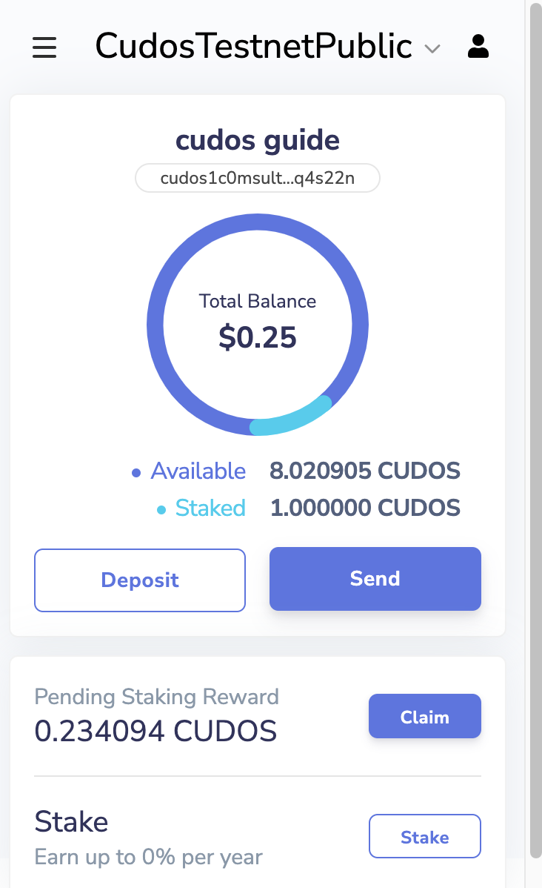

3. Put the recipient address and add the amount that you want to send then click on the button **Send**:

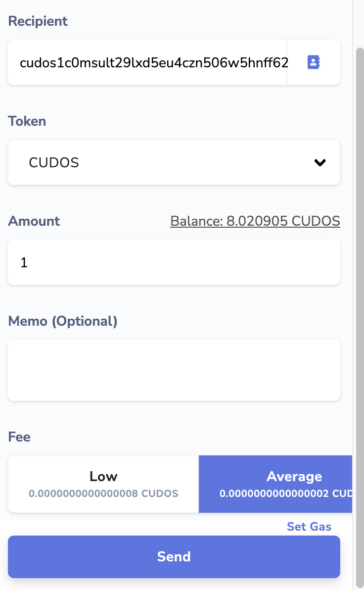

4. Click on the button **Approve** to successfully send your tokens:

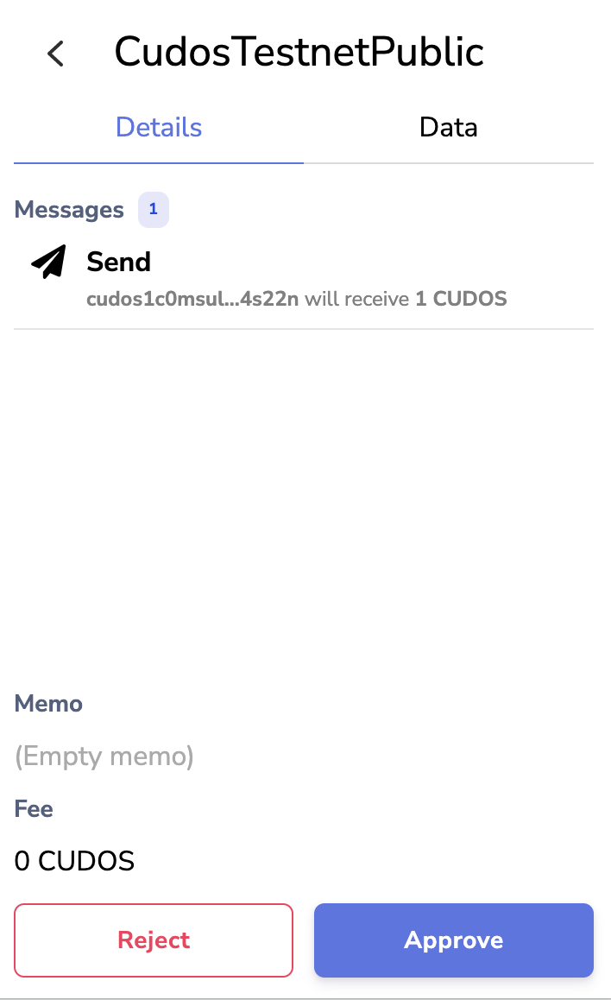

In order to send tokens via [Cudos explorer](https://explorer.cudos.org/), you need to go to your account and click on the button **transfer**:

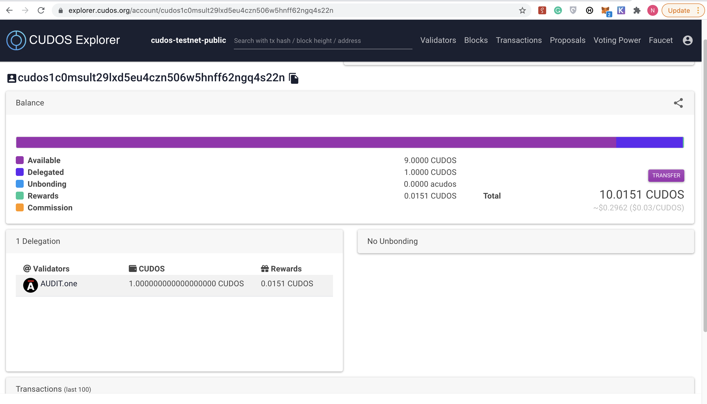

then you need to add the recipient address and the amount:

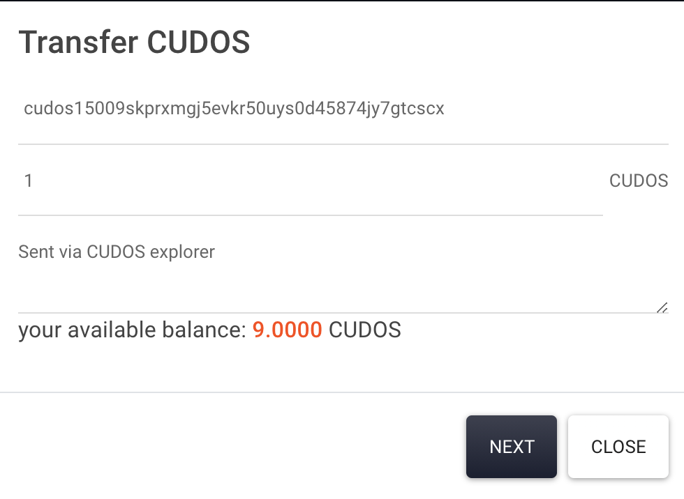

## Delegate tokens to a validator using Cudos explorer

1. Go to [Cudos explorer](https://explorer.cudos.org/)
2. Click on the tab [Validators](https://explorer.cudos.org/validators) and choose the active validator that you want to delegate your stake to:

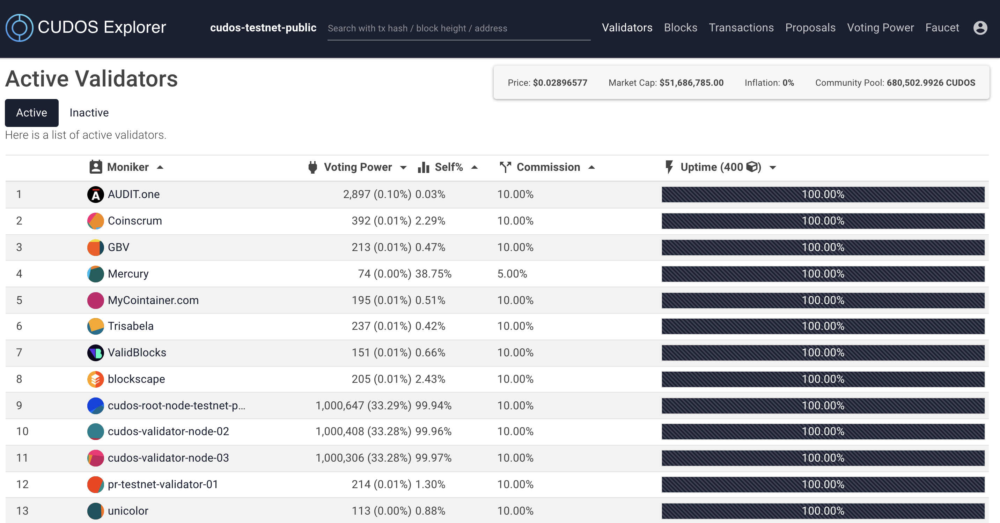

3. Click on the green button **DELEGATE**:

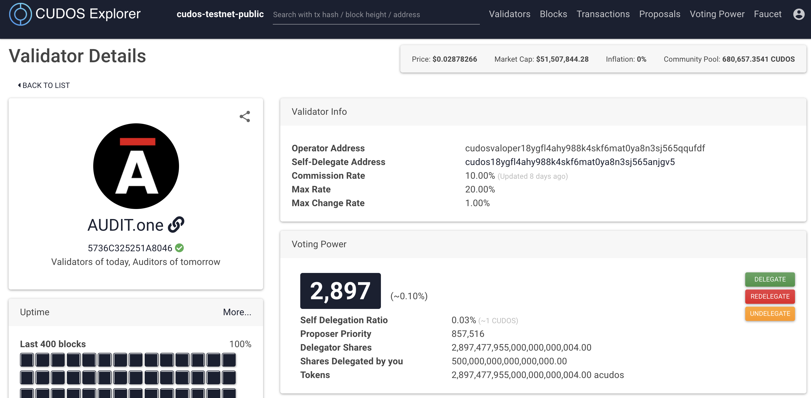

4. Add the amount of tokens that you want to delegate and click on the button **Next**

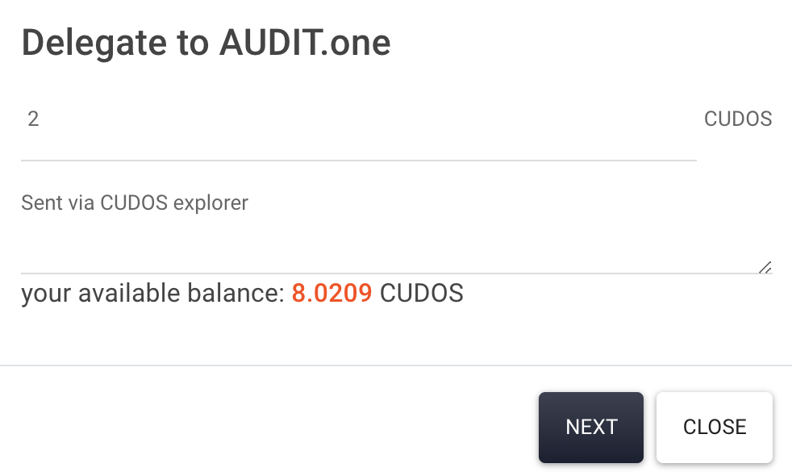

5. Click on the button **Approve**:

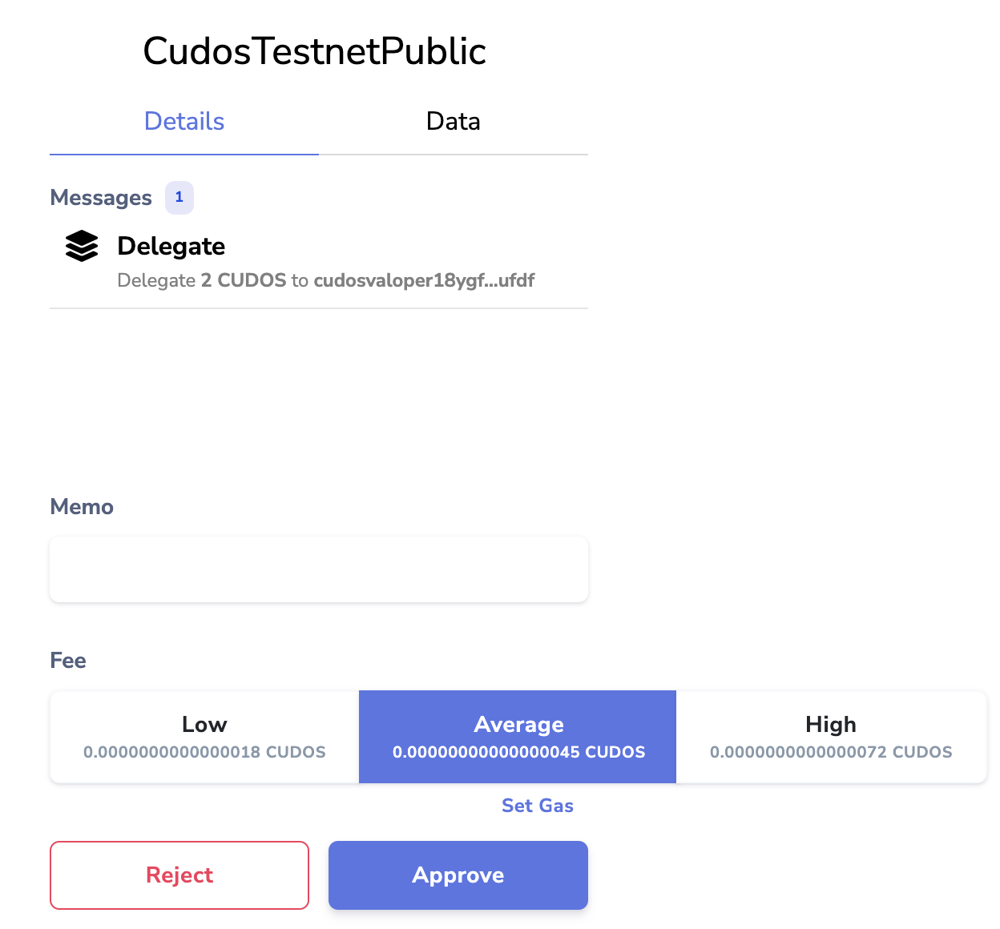

## Move your staked tokens to another validator

In order to move staked tokens to one validator to another, there is no need to undelegate and delegate them again.
Once you have delegated tokens to one validator, you can move them any time without penalty or waiting times (except for the transaction to be processed) by clicking the **REDELEGATE** button.
Namely,

1. Delegate tokens to a validator following the steps above
2. Go back to that Validator's page in the explorer
3. Click the red **REDELEGATE** button that sits between the delegate and the undelegate ones
4. Select the Validator you wish to move your tokens to, and the amount you want to move

5. Click **Next**, and then approve the transaction in Keplr.

## Claim rewards using Cudos explorer

1. Open your Keplr extension
2. Click on the button **Claim**:

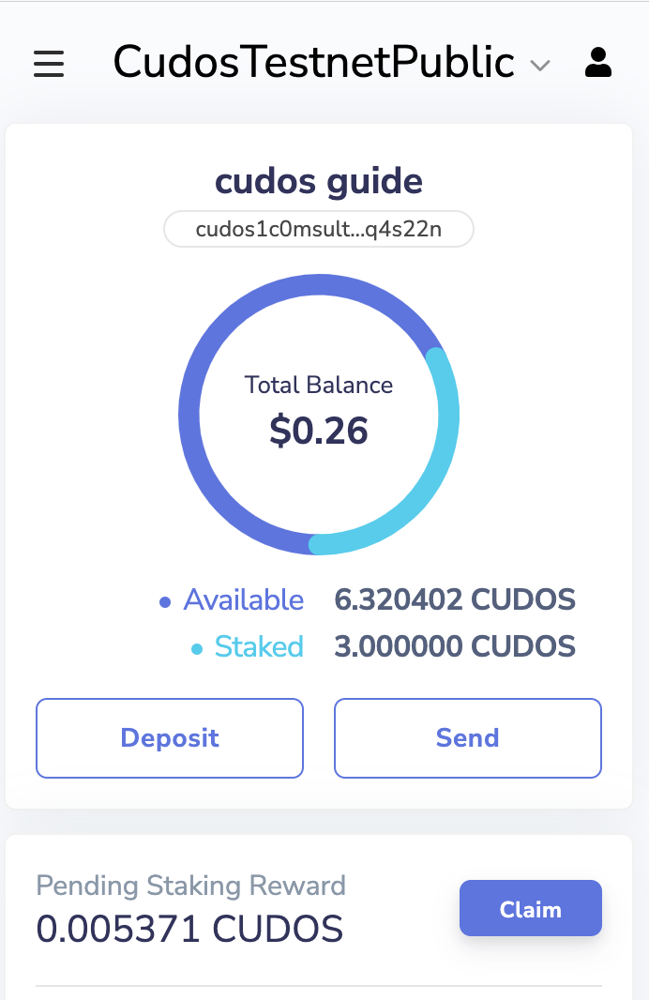

3. Click on the button **Approve**:

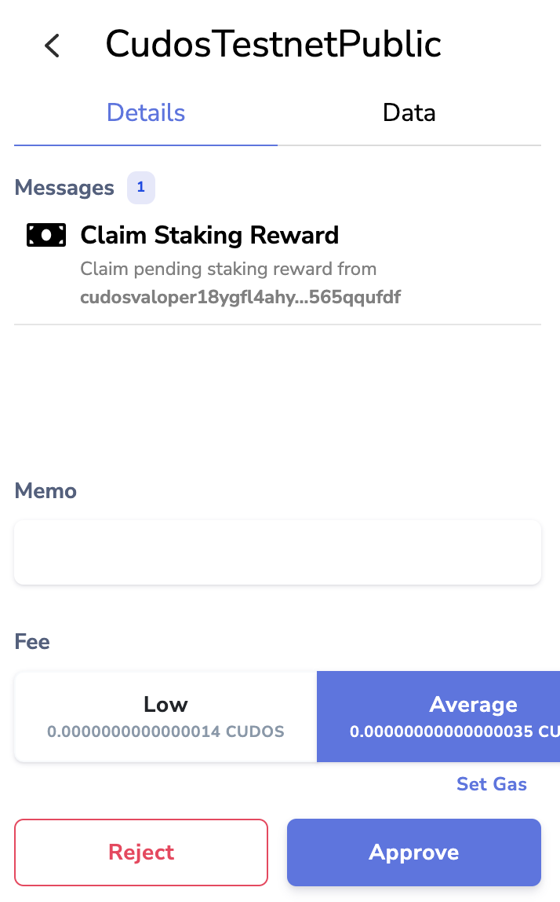

## Unstake tokens using Cudos explorer

1. Go to [Cudos explorer](https://explorer.cudos.org/)
2. Click on the tab [Validators](https://explorer.cudos.org/validators) and choose the active validator that you want to delegate your stake to:

3. Click on the button **UNDELEGTAE**:

4. Add the amount of tokens that you want to undelegate and click on the button **Next**

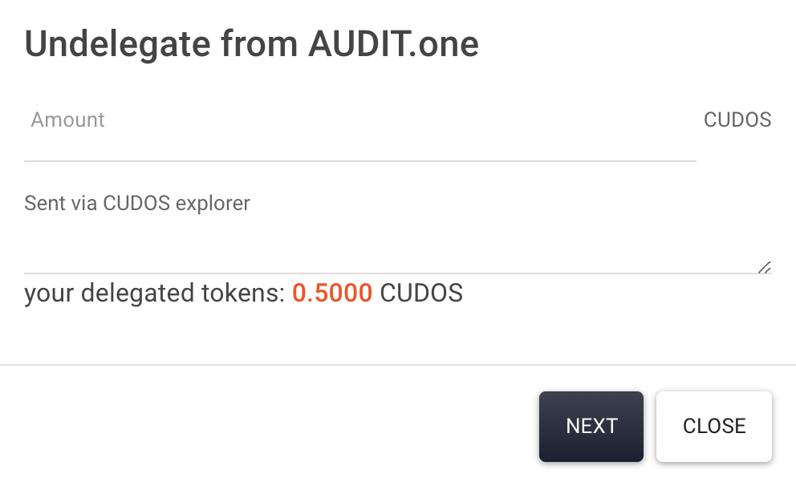

5. Click on the button **Approve**:

Please note that there is a 21-day unbonding period when you undelegate tokens, meaning it will take 21 days for these tokens to show in your wallet and be usable, for security reasons.
For more information please have a look at the [Cosmos docs](https://docs.cosmos.network/master/modules/staking/02_state_transitions.html#complete-unbonding).