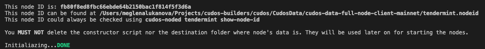
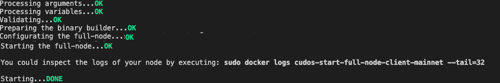

# Phase 4 instructions

This section describes the steps needed for validator setup as part of the Phase 4 testnet launch.


## Prerequisites

// TODO add the exact tags 

You need to have a local copy of our build tools.
```
git clone --branch phase-4  https://github.com/CudoVentures/cudos-builders.git CudosBuilders
```

## Nodes initialization

Validators should run at least 3 nodes - Seed, Sentry and Validator node. For more details you can check the Validator Setup docs - https://docs.cudos.org/build/validator.html#validator-setup.

This document will walk you through the automated process for validator setup. You won't need to execute anything other than the instructions listed bellow.

### Initialize the Full Node as a Validator
Setup your environment

Create your main Cudos directory. Note this step for the next

```
CUDOS_DIR = "/usr/cudos"
mkrid $CUDOS_DIR
```

Copy the ${WORKING_DIR}/cudos-builders/tools-bash/constructor/config/init.env.example and rename it to init.env. Example content of the file: 

```
PARAM_SOURCE_DIR="${CUDOS_DIR}}" // is where the repos will be cloned and the binary compiled. It should be an existing and empty folder. The same you created above
PARAM_VALIDATOR_MNEMONIC="<KEY>" // the private key of the account you want to use for your validator.
PARAM_KEYRING_OS_PASS="<PASS>" // the password of your keyring
```
Copy the ${WORKING_DIR}/cudos-builders/tools-bash/constructor/config/node.env.example and rename it to node.env. Example content of the file: 

```
MONIKER=<NAME_OF_THE_NODE>
CHAIN_ID=testnet-phase-4
MONITORING_ENABLED=true
PORT26656=60101
PORT26660=60102
START_CONTAINER_NAME=cudos-start-root-node
```

// TODO describe the process for ledger use


Now it's time to init your node. 

Make sure you have set the proper rights for the scripts

```
sudo chmod +x ${WORKING_DIR}/cudos-builders/tools-bash/constructor/src/start.sh
sudo chmod +x ${WORKING_DIR}/cudos-builders/tools-bash/constructor/src/init.sh
```

Initialize the node by running:
```
cd ${WORKING_DIR}/cudos-builders/tools-bash/constructor
./src/init.sh full-node
```
The command will use the configuration you have setup in the previous step and build the needed binaries. Successfull run should print someting like: 



If you see any additional messages or error please reffer to the troubleshooting section.

### Start the full node

Copy the ${WORKING_DIR}/cudos-builders/tools-bash/constructor/config/start.env.example and rename it to start.env. Example content of the file: 

```
PARAMS_PERSISTENT_PEERS=""
PARAMS_SEED=""
PARAMS_PRIVATE_PEER_IDS=""
```

Once everything is configured we can start the node

```
cd ${WORKING_DIR}/cudos-builders/tools-bash/constructor
./src/init.sh full-node
```


If you see any additional messages or error please reffer to the troubleshooting section.
## Sentry node setup

### Initialise the sentry node
Create your main Cudos directory. Note this step for the next
```
CUDOS_DIR = "/usr/cudos"
mkrid $CUDOS_DIR
```
Copy the ${WORKING_DIR}/cudos-builders/tools-bash/constructor/config/init.env.example and rename it to init.env. Example content of the file:
```
MONIKER="cudos-sentry-node-mainnet-01"
PERSISTENT_PEERS=""
PRIVATE_PEERS=<tendermintId>:26656
SEEDS=""

SHOULD_USE_GLOBAL_PEERS="false"
SHOULD_USE_STATE_SYNC="false"

TLS_ENABLED="false"

MONITORING_ENABLED="false"

EXTERNAL_ADDRESS=""
ADDR_BOOK_STRICT="true"
```


The most important step here is to setup the id of the full node in PRIVATE_PEERS
```
PRIVATE_PEERS=<tendermintId>:26656
```

To initialise the sentry node you need to execute the following

```
./src/init.sh sentry-node
```

### Start the sentry node
```
./src/start.sh sentry-node
```

## Seed node setup

### Initialise the seed node
Create your main Cudos directory. Note this step for the next
```
CUDOS_DIR = "/usr/cudos"
mkrid $CUDOS_DIR

```
Copy the ${WORKING_DIR}/cudos-builders/tools-bash/constructor/config/init.env.example and rename it to init.env. Example content of the file:
```
MONIKER="cudos-sentry-node-mainnet-01"
PERSISTENT_PEERS=""
PRIVATE_PEERS=<tendermintId>:26656
SEEDS=""

SHOULD_USE_GLOBAL_PEERS="false"
SHOULD_USE_STATE_SYNC="false"

TLS_ENABLED="false"

MONITORING_ENABLED="false"

EXTERNAL_ADDRESS=""
ADDR_BOOK_STRICT="true"
```


The most important step here is to setup the id of the full node in PRIVATE_PEERS
```
PRIVATE_PEERS=<tendermintId>:26656
```

To initialise the sentry node you need to execute the following

```
./src/init.sh seed-node
```

### Start the seed node
```
./src/start.sh seed-node
```


## Validator node initialization

Once all your nodes are running you'll be able to initialize your validator node. Execute the following command on the full-node machine:

```
sudo docker exec -it cudos-start-full-node-client-mainnet-01 bash
```

```
export STAKE="1000000000000000000acudos"
export CHAIN_ID="testnet-phase-4"

cudos-noded tx staking create-validator --amount=$STAKE \
    --from=validator \
    --pubkey=$(cudos-noded tendermint show-validator) \
    --moniker=$MONIKER \
    --chain-id=$CHAIN_ID \
    --commission-rate="0.10" \
    --commission-max-rate="0.20" \
    --commission-max-change-rate="0.01" \
    --min-self-delegation="1" \
    --gas="auto" \
    --gas-prices="0.025acudos" \
    --gas-adjustment="1.80" \
    --keyring-backend="os" \
    -y
```

## Gentx submition

Once your validator is running you should get it's gentx. It is located under /usr/cudos/cudos-data/config/gentx/ on your docker container. To get the file of the you can use 
```
sudo docker exec -it cudos-start-full-node-client-mainnet-01 "cat /usr/cudos/cudos-data/config/gentx/gentx-<tendermint-id>.json
```


# Things to keep in mind
1. The folder you use for a node needs to be created and empty. You will get errors otherwise.
2. If you are running more than one node on a same server, you might not be able to create the docker, because they will try to ppen the same ports.


# Troubleshooting
