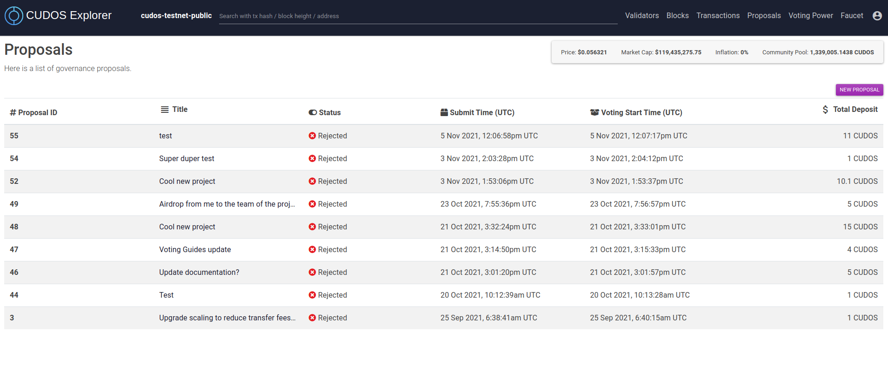
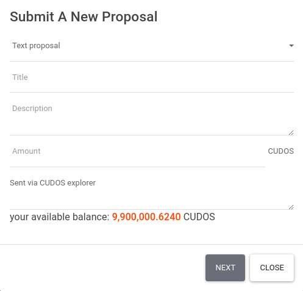
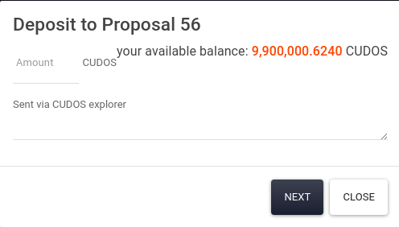
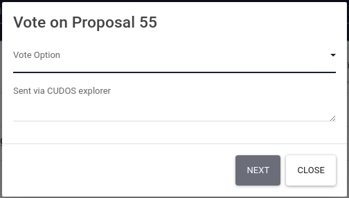
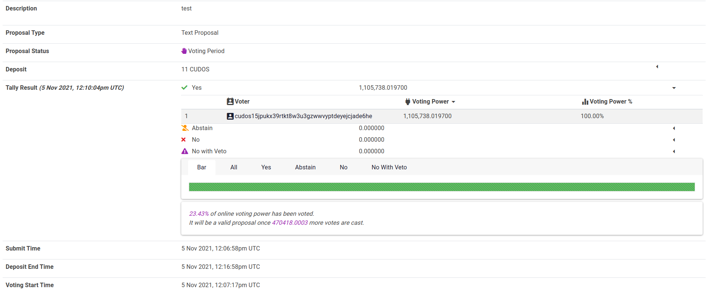

# Governance Proposals
<!-- TODO: improve this section, maybe move it to build, create subsections within it, explain more what each thing and each option is. Also add CLI instructions --> 
As mentioned above, any CUDOS holder is able to create a proposal to be voted via governance.
In order for a proposal to reach the voting stage, a [minimum deposit](https://docs.cosmos.network/master/modules/gov/01_concepts.html#deposit) is required (for the Cudos Testnet that value is 10 CUDOS).
Any CUDOS holder is able to deposit tokens to take the proposal to the voting stage.
In the Cudos Testnet, if after 10 minutes a proposal has not reached the voting stage it is automatically rejected.

## Creating a new proposal

In order to create a new proposal,

1. Connect you Keplr wallet to the explorer by clicking the top-right key symbol

2. Navigate to the proposals tab

3. Click on **NEW PROPOSAL**

4. Fill the new proposal form with your desired information. For a description of the fields and what each proposal type is please visit the [Cosmos docs](https://docs.cosmos.network/master/modules/gov/01_concepts.html#proposal-types)

5. Click **NEXT** and confirm the transaction in your Keplr wallet.

## Depositing CUDOS in an active proposal

In order to deposit CUDOS in an active proposal, the process starts in the same way as above,

1. Connect you Keplr wallet to the explorer by clicking the top-right key symbol

2. Navigate to the proposals tab

3. Click on an active proposal (status should be "Deposit Period")

4. Click on **DEPOSIT**

5. Write the amount of CUDOS you wish to deposit to this proposal

6. Click **NEXT** and confirm the transaction in your Keplr wallet.

## Voting in a proposal 

In order to vote, similar to the above, validators or delegators should:

1. Connect the Keplr wallet to the explorer

2. Navigate to the Proposals tab

3. Click on a proposal that has the "Voting Period" status

4. Once in, click on the **VOTE** button next to the deposit one

5. A window will pop up, where you should choose your vote and then click **NEXT**. The voting options can be found in the [Cosmos docs](https://docs.cosmos.network/master/modules/gov/01_concepts.html#option-set).

6. Once your vote has been cast, you will see your vote reflected on the proposal page.

