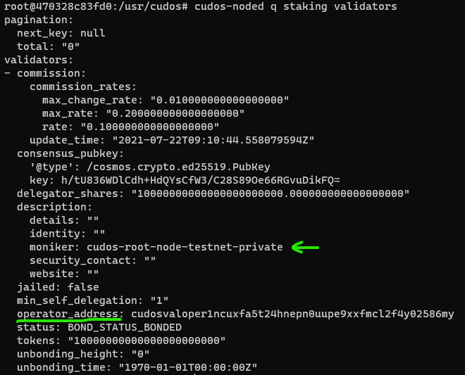
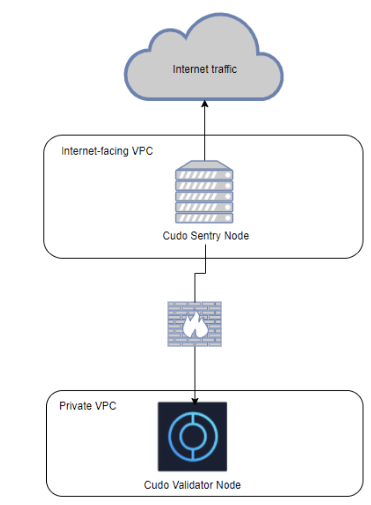

# Validator Setup Instructions (v0.3)

# Updates 14/10/2021

Find the full list of latest updates:

Update the section [Cudos Validator node and Orchestrator](/build/validator.html#cudos-validator-node-and-orcheatrator)

# Updates 22/09/2021

Find the full list of latest updates:
1. Add new section [How to separate your running nodes](/build/validator.html#how-to-separate-your-running-nodes)
2. Update the parameter **PRIVATE_PEERS** in the step 6 within the section [Configure and start the Sentry node as a validator](/build/validator.html#configure-and-start-the-sentry-node-as-a-validator)
3. Update the parameter **PRIVATE_PEERS** in the step 6 within the section [Configure and start the Seed node as a validator](/build/validator.html#configure-and-start-the-seed-node-as-a-validator)
4. Update the [Ethereum full-node](/build/validator.html#ethereum-full-node) section with the [standard recommendation and specification](https://ethereum.org/en/developers/docs/nodes-and-clients/#recommended-specifications)
5. Add new section [How to delete a current running node](/build/validator.html#how-to-delete-a-current-running-node)
6. Update the section [hardware requirements](/build/validator.html#hardware-requirements)

## Validator Setup

### How to separate your running nodes

As explained in the article [Types of Nodes](/learn/validators.html#types-of-nodes) there are three types of nodes: Full, Sentry, and Seed node.

In order to have a secure and running network, you will need to run each of the following nodes on a separate and different machine:

1. Validator Full node along with the Orchestrator configuration
2. Sentry node on a separate local machine
3. Seed node on a separate local machine
4. Ethereum full node, you can run it virtually on a cloud

As a validator, you must run an orchestrator. The orchestrator requires an Ethereum full node to connect to. If your Ethereum full node and the orchestrator are within a private network, you need to run the orchestrator on the same physical machine as the validator. Otherwise, If the network is public, you will need a separate machine for the orchestrator that must reside in the validator's private network. This will ensure that the validator machine is not making a public connection with any physical machine.

For one or more validator nodes it is recommended to launch a layer of sentry nodes (at least 1 Sentry node) and optionally Seed nodes with isolating the validator node behind that layer.

You need an IP-address per node which is directly connected to the network. For example, If you have **N** validator nodes and only one Sentry node then only the Sentry node is directly connected to the network. In this case you will need a single IP-address.

The picture below shows the diagram of validator topology:


Note that if you are running the setup not for the first time, then you will need to read the section [How to delete a current running node](/build/validator.html#how-to-delete-a-current-running-node).

This article guides you through the instruction for running each one of those nodes.

### Run a Full node

Before running a node, make sure that you have followed the guide for [setting up your prerequisites and environment](/build/prerequisites.html).

To run a full node, you need to complete the following steps:

- Initialize the node
- Configure and start the node

#### Initialize the Full node as a validator

When you run a validator node, you play an important role in the security of a network. A validator must be secure and fault-tolerant. So it is recommended to run your validator with a layer of 1 or more sentry nodes and to isolate the validator node behind that layer. Also, you will need an IP-address per node that is connected to the network. For example, if you have 10 validator nodes and only one Sentry node then only the Sentry node will be connected to the network where you will need a single IP-address.

In total, Cudos has [three types of nodes](/learn/validators.html#types-of-nodes) and as a validator, you need to have at least:
* one Sentry node
* one Full node

You can initialize the full node as the following:

1. Navigate to the directory *CudosBuilders/docker/full-node*
2. Find the file **full-node.env.example** and create a copy of it
3. Rename the copied file to **full-node.client.testnet.public01.env**
4. Open the file, which you renamed, **full-node.client.testnet.public01.env** in any editor
5. Find both the **"MONIKER"** attribute and the flag **"SHOULD_USE_GLOBAL_PEERS"** and set them as the following :
```
MONIKER=MyFullNodeName
SHOULD_USE_GLOBAL_PEERS=false
```
6. Leave other variables such as "PERSISTENT_PEERS" and "SEEDS" empty and save the changes that you made to the file.
7. Make sure that you are still in the correct directory **CudosBuilders/docker/full-node**
8. Initialize the node by running this command:
```
sudo docker-compose --env-file full-node.client.testnet.public01.arg -f init-full-node.yml -p cudos-init-full-node-client-testnet-public-01 up --build
```

If all steps are completed successfully, you should see a newly generated folder called **CudosData** at the same directory where you placed *CudosBuilders* and *CudosNode*. The subdirectory *cudos-data-full-node-client-testnet-public-01* of **CudosData"** folder has a file called **tendermint.nodeid**. This file contains your node **Id,** to see your node id you can open this file in any code editor and you will get one line that represents your node id such as 13f359c90582b12e291311980a855854668d80pc.

#### Configure and start the Full node

Now you need to configure and start the full node. So far the full node is set to be isolated and to connect the full node to the network, it needs Sentry peers. The full node should run behind the layer of running a Seed node and a Sentry node with all necessary configuration and starting the node as a validator.

There are two different parameters for selecting the way to connect peers:

* **PERSISTENT_PEERS** are list of peers that your current node is ALWAYS connected to (usually it is the list of all sentry nodes). It contains a list of comma separated peers that you will always want to be connected to.
* **PRIVATE_PEERS** are list of peers that your current node does not share and it is totally private. For example - the Sentry/Seed node MUST set its validator (if available) as a private peer in order to avoid sharing your validator's id/ip to the rest of the network. So it is a comma-separated list of node ids that will not be exposed to other peers which can be filled with a validator’s node id.

The full node must communicate only through the created layer of peers. To achieve that, you will need to apply the following steps:

1. [Run a Sentry node](#run-a-sentry-node), configure, and start it as a validator
2. [Run a Seed node](#run-a-seed-node), configure, and start it as a validator. This is an optional recommended step.
3. Get the Sentry and Seed **node ids** and add them inside the file **full-node.client.testnet.public01.env**. Leave the variable _SEEDS_ empty if you do not have seed nodes. If you have more than one Sentry or Seed node, you can separate them by a comma within the variable _PERSISTENT_PEERS_:
```
PERSISTENT_PEERS=<sentry-node1-id>@<sentry-node1-ip>:26656,<sentry-node2-id>@<sentry-node2-ip>:26656
SEEDS=<seed-node1-id>@<seed-node1-ip>:26656,<seed-node2-id>@<seed-node2-ip>:26656
```
4. Open the terminal and navigate to **CudosBuilders/docker/full-node**
5. Configure your node:
```
sudo docker-compose --env-file full-node.client.testnet.public01.arg -f config-full-node.yml -p cudos-config-full-node-client-testnet-public-01 up --build
```
6. Start your node
```
sudo docker-compose --env-file full-node.client.testnet.public01.arg -f start-full-node.yml -p cudos-start-full-node-client-testnet-public-01 up --build --detach
```

Note that you can see the logs by running the command:
```
sudo docker logs -f cudos-start-full-node-client-testnet-public-01
```

### Run a Sentry node

Before running a node, make sure that you have followed the guide for [setting up your prerequisites and environment](/build/prerequisites.html).

To run a sentry node, you need to configure and start the node.

#### Configure and start the Sentry node as a validator

1. Navigate to the directory *CudosBuilders/docker/sentry-node*
2. Find the file **sentry-node.env.example** and create a copy of it
3. Rename the copied file to **sentry-node.client.testnet.public01.env**
4. Open the file, which you renamed, **sentry-node.client.testnet.public01.env** in any editor
5. Find  the **"MONIKER"** attribute and set a name to it as the following:
```
MONIKER=MySentryNodeName
```
6. Paste the full node's nodeId in the **PRIVATE_PEERS** line. If there are multiple full nodes ids, separate them by a comma such as:
```
PRIVATE_PEERS=<full-node1-id>@<full-node1-ip>:26656,<full-node2-id>@<full-node2-ip>:26656
```
7. Make sure that you are still in the correct directory **CudosBuilders/docker/sentry-node**
8. Initialize the node by running this command:
```
sudo docker-compose --env-file sentry-node.client.testnet.public01.arg -f init-sentry-node.yml -p cudos-init-sentry-node-client-testnet-public-01 up --build
```
9. Start the node by running this command:
```
sudo docker-compose --env-file sentry-node.client.testnet.public01.arg -f start-sentry-node.yml -p cudos-start-sentry-node-client-testnet-public-01 up --build --detach
```

Note that you can see the logs by running the command:
```
sudo docker logs -f cudos-start-sentry-node-client-testnet-public-01
```

### Run a Seed node

Before running a node, make sure that you have followed the guide for [setting up your prerequisites and environment](/build/prerequisites.html).

To run a seed node, you need to configure and start the node.

#### Configure and start the Seed node as a validator

1. Navigate to the directory *CudosBuilders/docker/seed-node*
2. Find the file **seed-node.env.example** and create a copy of it
3. Rename the copied file to **seed-node.client.testnet.public01.env**
4. Open the file, which you renamed, **seed-node.client.testnet.public01.env** in any editor
5. Find  the **"MONIKER"** attribute and set a name to it as the following:
```
MONIKER=MyseedNodeName
```
6. Paste the full node's nodeId in the **PRIVATE_PEERS** line. If there are multiple full nodes ids, separate them by a comma such as:
```
PRIVATE_PEERS=<full-node1-id>@<full-node1-ip>:26656,<full-node2-id>@<full-node2-ip>:26656
```
7. Make sure that you are still in the correct directory **CudosBuilders/docker/seed-node**
8. Initialize the node by running this command:
```
sudo docker-compose --env-file seed-node.client.testnet.public01.arg -f init-seed-node.yml -p cudos-init-seed-node-client-testnet-public-01 up --build
```
9. Start the node by running this command:
```
sudo docker-compose --env-file seed-node.client.testnet.public01.arg -f start-seed-node.yml -p cudos-start-seed-node-client-testnet-public-01 up --build --detach
```

Note that you can see the logs by running the command:
```
sudo docker logs -f cudos-start-seed-node-client-testnet-public-01
```

## Create a validator

In order for your cudos node to act in the role of validator, it will need bring together the validator server and the orchestarator server with the 3 wallets identified above. It will require:

1. A running Ethereum full-node
2. A running Cudos Full node ,which has the validator configuration, and a setup of the orchestrator.

Only after finalising previous steps, you can start the process of staking to the node, making it a fully functional validator node. this section explains how to achieve each step in detail.

### Ethereum full node

First make sure that you have the [standard recommendation and specification](https://ethereum.org/en/developers/docs/nodes-and-clients/#recommended-specifications) for the Ethereum node.

You can use either an existing [Ethereum full-node](https://ethereum.org/en/developers/docs/nodes-and-clients/#full-node) (if you have one) or you can follow the procedure below to start one but make sure not to use Infura:

1. Run your Ethereum binary on a different machine that your validator is running
2. Clone the correct branch from the [CudosBuilders](https://github.com/CudoVentures/cudos-builders) repository with renaming the folders accordingly to exactly _CudosBuilders_:
```
git clone --depth 1 --branch v0.3 https://github.com/CudoVentures/cudos-builders.git CudosBuilders
```
3. Open shell, navigate to the directory _CudosBuilders/docker/ethereum_ and start the Ethereum full-node by running the command:
```
cd CudosBuilders/docker/ethereum && sudo docker-compose -f ethereum-full.yml -p ethereum up --build --detach
```

In order for the Ethereum node to function properly it needs to syncronise to the Etehreum blockchain. This takes around 12 hours on a reasonably performing network and hardware and will require at least 150GB of free filesystem space, over and above the operating system, to accomodate this database. You can see the logs by running the command:
```
sudo docker logs -f ethereum
```

You should periodically monitor the free space on the disk you are operating on and if you fall under a certain limit you should shutdown the node. Otherwise, you will get the following ERROR message:

```
Low disk space. Gracefully shutting down Geth to prevent database corruption.
```

### Cudos Validator node and Orchestrator

#### Executing "cudos-noded" commands

The cudos-noded service is a single binary running inside a docker container. It cannot be called directly from the main operating system. To do so requires either running the "docker" command with the command at issue on the end eg:

```
sudo docker exec -it cudos-start-full-node-client-testnet-public-01 <My Command>
```

The above will run the command "<My Command>" in the docker context, ie inside the container. Or an interactive prompt can be produced by calling:

```
# Access the container, that is needed to connect to its bash, directly with its name This will run the command "bash" inside the docker container "cudos-start-full-node-client-testnet-public-01". Note that the "-it" flags ensure that the bash prompt that will then be visible is usable in the normal way. In order to script the above, different choices would be needed.

sudo docker exec -it cudos-start-full-node-client-testnet-public-01 bash
```

#### Checking the state of the seed and sentry nodes

This section requires that the section [running Cudos full-node as a validator](#validator-setup) has already been completed.

After starting the validator and ethereum nodes, the chain will begin to sync to the network. The time to sync to the network will vary depending on your setup and the current size of the blockchain, but could take a very long time (up to 12 hours or more). To query the status of your node, run the command:

```
# To determine the value of the status variable "catching_up"

sudo docker exec -ti cudos-start-full-node-client-testnet-public-01 cudos-noded status | jq '.SyncInfo.catching_up'

# To determine the "block height". For reference, the current block height is in excess of 663000 If "catching_up" is "**true"**, then the machine is not ready and will need a period of 12 hours or more before it will be ready for staking.

sudo docker exec -ti cudos-start-full-node-client-testnet-public-01 cudos-noded status | jq '.SyncInfo.latest_block_height'
```

#### Stashing the wallet keys

The next step is to stash the wallet address (mnemonic) in the validator node's internal keychain.

For this the following information is required:

- The mnemonic of the Keplr wallet designated for use with the validator

The "mnemonic" of the keplr wallet is the long string of random words that is generated when the wallet was first created, and that is used subsequently open the wallet. This string is both the password to get the wallet open and the location of the wallet, it is both the address and the password combined. Use of copy/paste is advised to enter this value.

- The validator's keychain passphrase

The validator has an internal keychain used to hold such things as, in this case, the mnemonic of the wallet it should use. If this is the first time the validator's internal keychain has been used it will not have a passphrase set and will require one when the command is run. If this is the second or subsequent time, the wallet is already locked and will require the same passphrase that was previously used to create the keychain.

In the case where the keychain has not previously been used, the passphrase will be requested twice as a precaution. On subsequent occasions it only requires the user to enter this value once to open the existing wallet.

It is advised that the user generate this ahead of time and note it down with the keplr mneminics (one each for the validator and the orchestrator). The use of such tools as "pwgen" is advised along with copy/pasting to enter the passphrase, as it should be a long random string.

The command itself should be executed as is. The "wallet name", in this case "validator" (the 3rd option below) can be any name, the name is reused further on in this process, so it is advised to stick to the name "validator" for this wallet link.

Run the command:
```
# Add the wallet in your nodes' keyring:
cudos-noded keys add validator --recover --keyring-backend="os"
```

If the command returns without error and produces something like the following, then the process is complete and the keychain is now loaded with the validator wallet address:
```
- name: validator
  type: local
  address: cudos17g4kjshkjhuhfvihhns9e36epgs9yxpz8k
  pubkey: '{"@type":"/cosmos.crypto.secp256k1.PubKey","key":"AxuisjteQw5ZNchnFk0nXsdknchefygeirfgIWeC"}'
  mnemonic: ""
```

#### The staking process

This step, if successful, will put the node on the list of validators at:
[https://explorer.cudos.org/validators](https://explorer.cudos.org/validators)

In this section of the process the validator node will need to be supplied with the staking request using a cudos-noded sub-command, done in this case using a number of environment variables on the command line:

- **CHAIN_ID**, This is a fixed text naming the blockchain to be operated on. In the public testnet this name is "cudos-testnet-public"

- **STAKE**, The actual amount in "acudos" that will be staked to the validator. Note that *acodos* is a very small denomination. Be very careful about the number of zeros in the amount. For example "1000000000000000000acudos" = 1 CUDOS.

Note that This command must be run within the docker container. Use the following command to start a bash shell within the container:

```
sudo docker exec -it cudos-start-full-node-client-testnet-public-01 bash
```

It is then advised that the following be copy/pasted into the shell prompt created by the above.

```
cudos-noded tx staking create-validator --amount=$STAKE \
    --from=validator \
    --pubkey=$(cudos-noded tendermint show-validator) \
    --moniker=$MONIKER \
    --chain-id=$CHAIN_ID \
    --commission-rate="0.10" \
    --commission-max-rate="0.20" \
    --commission-max-change-rate="0.01" \
    --min-self-delegation="1" \
    --gas="auto" \
    --gas-prices="0.025acudos" \
    --gas-adjustment="1.80" \
    --keyring-backend="os" \
    -y
```

This command will request the validator keyring passphrase. This will not be the first time the keychain has been used. It will at least contain the validator's keplr wallet mnemonic, so it will only ask for the passphrase once, and then it has all it needs to complete the transaction.

:::tip
Be aware not to exit the docker shell. You will need it for the next step that is registering the orchestrator. Note that if you get a message that the transaction is not included in any block, please wait a few seconds and do not start another transaction.
:::

If you get a message along the lines of:
```
Error: rpc error: code = NotFound desc = rpc error: code = NotFound desc = account cudos1mnc7gm9sazrmcfdkshhmx3f0s4n2wp944wzjj4 not found: key not found
```

Then it is likely that either the validator node hasn't actually caught up with the blockchain sync operation yet (so the validator can't find the block in the blockchain in which the keplr wallet took in its funds), or the validator keplr wallet has insufficient funds to cover the transaction, or both.

If the command succeeds, you should see your new validator appear on the list of validators referenced above. Do ensure that you also check the **"Inactive"** tab as well, as there may be a problem with the machine that prevents it from being active.

If you see the transaction hash without getting any error, then congrats you have successfully created a validator account.

### Orchestrator

The orchestrator is a program that runs on every validator node beside the Cudos code. The Gravity bridge enables token transfers from Ethereum to Cudos and back again. Validators running a chain with an installed Gravity module use the orchestrator's wallet to sign messages or transactions. During the process of creating an orchestrator, the validator signs a transaction that contains data about the orchestrator address of this validator. Therefore, the orchestrator uses the wallet to sign this data and all gravity-related transactions.

The Orchestrator monitors the Ethereum chain, submitting events that occur on Ethereum to Cudos as messages. To send transactions from Cudos to Ethereum, the Gravity Bridge module first packages the transaction data and makes it available on an endpoint. The Orchestrator then signs this data with the validator’s Ethereum key, and submits it as a message. These signatures will then be assembled and submitted to the Ethereum chain. For more information, please read the [Gravity bridge design overview](https://github.com/althea-net/cosmos-gravity-bridge/blob/main/docs/design/overview.md).

#### Get the validator address

After you have created a validator account, you must find your validator address by running the command:
```
cudos-noded q staking validators
```

the resulting output looks similar to the picture below, you need to find your validator, you can refer to the moniker to find it, and copy its **operator_address**:


#### Add the orchestrator wallet

Now you MUST [add another wallet](/build/account-setup.html#creating-a-keplr-wallet) to use for the orchestrator (do not use the same validator wallet) and make sure that **it has some CUDOS tokens**. You can achieve that by running the command:
```
cudos-noded keys add orchestrator --recover --keyring-backend="os"
```

This command is very similar to the command that added your validator wallet address to the validator's internal keychain above. The only differences between executing that command and this are:

- The name of the key to add to the keychain. Here, "**orchestrator**" is used, where the last time "validator" was used. This is because the validator requires two separate wallets.
- The command will only request your keychain passphrase the once this time. Last time it was creating the wallet, so required that a passphrase was created, whereas this time the keychain already exists and already has content, so the passphrase is used only for unlocking, so it requested only once.

If the command succeeds it will output something like (note that this time the name is orchestrator rather than validator):
```
- name: orchestrator
  type: local
  address: cudoskjhkjhkjhkjhuhfvihhns9e36epgs9yxpz8k
  pubkey: '{"@type":"/cosmos.crypto.secp256k1.PubKey","key":"txtfcvuhyibnoknmhnFk0nXsdknchefygeirfgIWeC"}'
  mnemonic: ""
```

:::tip
Note that after running the command above, you will need to enter both your mnemonic address for the account and the password which you have created on a previous step while adding the validator's wallet.
:::

The resulting output looks similar to the picture below. You will need the address of this wallet and mnemonic for the next steps.


#### Register and run the orchestrator

Note that to complete this section a **3rd wallet is required**. There was the keplr wallet used above for the staking process and the orchestarator keplr wallet used in this process, but there's a need for a 3rd wallet to store funds in ETH for this process. It is advised that a [Metamask wallet be created](https://metamask.zendesk.com/hc/en-us/articles/360015290012-Using-a-Local-Node).


Add the following variables and register the orchestrator:
```
export VALIDATOR_ADDRESS="<validator's operator_address>"
export ORCH_ADDRESS="<orchestrator's CUDOS wallet address (Keplr)>"
export ETH_ADDRESS="<orchestrator's ETH wallet address (Metmask)>"
export CHAIN_ID="cudos-testnet-public"

cudos-noded tx gravity set-orchestrator-address $VALIDATOR_ADDRESS $ORCH_ADDRESS $ETH_ADDRESS --from validator --keyring-backend "os" --chain-id $CHAIN_ID
```
Where:
- **VALIDATOR_ADDRESS** is the validator's operator address, as seen in the output from "cudos-noded q staking validators" above. Note that this is of the form "**cudosvaloper**17g4pjqjtxrxz35jcsx3jhns9e36epgs9e40rxt"
- **ORCH_ADDRESS** is the address of the keplr wallet designated for the orchestrator. Note that this is if the form "**cudos**17g4pjqjtxrxz35jcsx3jhns9e36epgs9yxpz8k"
- **ETH_ADDRESS** is the public receiving address of your Ethereum wallet so it does not require any node installation, only copy-paste your Ehtereum address from your Metamask account/wallet
- **CHAIN_ID** is, as above the fixed string "cudos-testnet-public"

If you do not have any Ehtereum tokens in your wallet, then you can read the article [Ethereum Blockchain – Getting Free Test Ethers For Rinkeby Test Network](https://www.geeksforgeeks.org/ethereum-blockchain-getting-free-test-ethers-for-rinkeby-test-network/) and the [how to use Metamask article](https://levelup.gitconnected.com/how-to-use-metamask-a-step-by-step-guide-f380a3943fb1)


Now let's run the orchestrator, please make sure to run your gravity bridge binary on the same machine that your validator node is running on.
1. Open shell and navigate to the directory _CudosBuilders/docker/orchestrator_
2. Create a copy of **orchestrator.env.example**
3. Rename it to **orchestrator.client.testnet.public01.env**
4. Open the file _orchestrator.client.testnet.public01.env_ in any editor and set all of the parameters.
5. Delete any comments from this file (delete # and everything after it), the parameter **GRPC** is the port value of the Sentry node.
```
ADDRESS_PREFIX="cudos"
FEES="100acudos"
CONTRACT_ADDR="0xb22F2A4c231e69703FC524Eb2E3eb7B83C316F42"

GRPC="http://<ip of your cudos node>:9090" # port should be 9090
ETHRPC="http://<ip of ethereum node>:8545" # port should be 8545
COSMOS_ORCH_MNEMONIC="<mnemonic of your orchestrator account>"
ETH_PRIV_KEY_HEX="<private key of your eth wallet>"
```
Where:
- **ADDRESS_PREFIX** is a fixed string "cudos"
- **FEES** is a value in acudos for the fee that you will have to pay for each bridge operation. In this example 100 acudos.
- **CONTRACT_ADDR** is a fixed string "0xb22F2A4c231e69703FC524Eb2E3eb7B83C316F42"
- **GRPC** is the http URL pointing to port 9090 of the sentry node eg:
http://sentry-1.example.com:9090
- **ETHRPC** is the http URL pointing to port 8545 of the ethereum node eg
http://ethereum.example.com:8545
- **COSMOS_ORCH_MNEMONIC** is the mnemonic address of the keplr wallet designated for use by the orchestrator. See "**Add the orchestrator wallet**" above.
- **ETH_PRIV_KEY_HEX** is the private key of your eth  metamsk wallet that was used to registered for use by the orcheatrator>" # in hex format without leading 0x

6. Execute the following command to start the orchestrator process, Note that the command must be run within the same directory used to hold and fill in the file *orchestrator.client.testnet.public01.env*. Note that this command must be run on the validator node as root, in the main shell, not inside the docker container. The command calls into the container to complete the process:
```
sudo docker-compose --env-file orchestrator.client.testnet.public01.arg -f orchestrator.release.yml -p cudos-orchestrator-client-testnet-public-01-release up --build --detach
```

you can see the logs by running the command:
```
sudo docker logs -f cudos-orchestrator-client-testnet-public-01-release
```
Note that the container used in this command is different to the one used in similar commands run for the validator function.


### Send funds using the gravity bridge

You have two different options to send funds (it is recommended to use the first option UI):
1. Using gravity bridge UI
2. Using the console

#### Using the gravity bridge UI (recommended option)

Open [Gravity Bridge](http://35.192.177.142:4000/). Then you can use [Kelpr](https://wallet.keplr.app/) and [Metamask](https://metamask.io/) for sending funds between the two blockchains.

#### Using the console (not recommended option)

1. Start docker shell once again, like you did when you have created your validator
2. Connect to the orchestrator instance instead of the validator one
3. Choose how you want to send funds
4. Before sending funds to Ethereum please check the available balance in the smart contract on the address.
5. Send funds from Ethereum to Cudos by running the command:
```
./gbt client eth-to-cosmos \
  --ethereum-key "<private key of the sender in hex without leading 0x>" \
  --gravity-contract-address "0x9fdE6D55dDa637806DbF016a03B6970613630333" \
  --amount <amount in CUDOS without ""> \ #example 0.000000000000000001
  --destination "<destination cudos address>" \
  --token-contract-address "0x28ea52f3ee46cac5a72f72e8b3a387c0291d586d" \
  --ethereum-rpc "http://<ip of your ethereum node>:8545"
```
6. Send funds from Cudos to Ethereum by running the command:
```
./gbt --address-prefix="cudos" client cosmos-to-eth \
    --amount="<amount in acudos>" \ # example "1acudos"
    --cosmos-grpc="http://<ip of your cudos node>:9090" \
    --cosmos-phrase="<mnemonic of sender>" \
    --eth-destination="<destination eth address>" \
    --fees="<fee that will be kept in the bridged>"
```

Note that The commands of sending funds takes up to few minutes to be executed.

## How to delete a current running node

If you stop the docker container that is running a Full node then you are not able to use it. But if you want to remove the full node docker data then you need to clear the volume of full node docker, if you remove the folder it will remove all the data but make sure first that you stop the docker container.

Clear the volume of full node docker:
* Navigate and open the file **CudosBuilders/docker/full-node/full-node.client.testnet.public01.arg**
* Find the var **VOLUME_NAME=cudos-data-full-node-client-testnet-public-01** and clear it
* Navigate to the file **CudosBuilders/docker/full-node/start-full-node.yml**
* Find the one volume field
volumes: **- '../../../CudosData/$VOLUME_NAME:$CUDOS_HOME'**
* Above **VOLUME_NAME**  is mapped with this **../../../CudosData/$VOLUME_NAME**, clear it

Remove the folder:
Navigate to the folder **CudosData**, you may find a folder known as **cudos-data-full-node-client-testnet-public-01**, this is the folder which store all data of full node and needs to be removed.

## Secure your node

Setting up a Cudos Node is the starting point for any user wanting to interact with, and play a greater part in, the network. In order to set up a Cudos node, users will require the use of Go/Golang version 1.15 or higher. On-premise or bare metal server providers such as OVH, Leaseweb, IBM, Alibaba, Amazon Web Services, Google Cloud Computing platform, or Microsoft Azure, can be used to generate Cudos nodes and join the Cudos Network.

Once the appropriate hardware and software requirements are met, users will then need to install the Cudos Network’s high-performance compute blockchain through version control systems such as Github or use the network’s release tags and build from source. The Cudos Network application is the application that defines the Cudos Network and its special purpose compute workflows.

This application consists of a Cudos Network daemon and command-line interface that, once deployed, runs a full-node version of the Cudos Network blockchain for users to interact with. This bespoke implementation supports innovations such as Inter-Blockchain Communication (IBC) protocol to guarantee high levels of reliability and cross-chain interactions inspired by the network’s computing capabilities. This Cudos Network blockchain additionally leverages the most vetted modules within the Cudos community such as staking, authentication, and governance logic. It also includes special blockchain components and developer toolchains linked to its unique set of high-performance compute use cases and development workflows.

### Recommendations for securing a Validator node

Cudos Validating nodes are Cosmos SDK-specified full nodes. This allows for a heavier-duty set of transaction processing workflows and network-level security exchanges with other members of the network. When setting up a Cudos Network Validator node, Validators will have to decide whether they want to be fully responsible for Key Management or if they want to leverage third-party infrastructure to do so. The Cudos Network blockchain leverages the Tendermint Key Management System in order to ensure high availability access to signing keys as part of the Cudos Network’s block processing workflows. This additionally allows this blockchain to prevent double-signing events. In practice, this feature allows for the tamper-proof storage of Hardware Security Module (HSM) Validator keys, even if the host has been compromised. If choosing to implement an HSM, the Validator should review that HSM's documentation in conjunction with the Tendermint KMS requirements, to ensure suitable compatibility before finalising a choice about this part of the security architecture.

An additional security and availability consideration is the use of one or more sentry nodes between a Validator node and the public internet. This mechanism is used to place a layer of separation between the security-sensitive Validator node, and would-be sources of attack.

Such attack types can include things like traffic-volume-based distributed denial-of-service (DDoS) attacks, designed to starve the Validator of available bandwidth in servicing legitimate usage, as well as malformed/spam message attacks, intended to consume processing or storage resources on the Validator, or induce unintended behaviour.

We currently recommend the use of one sentry node whose exterior faces the public internet, with its interior attached to a private internal network. The Validator node then is connected solely to the private internal network, therefore allowing the proxying of all requests to and from the Validator via the sentry. Additionally, we recommend that the sentry's internet connection is further protected by a provider-managed firewall and DDoS-mitigation service.



As previously indicated in the node minimum hardware requirements, our favoured recommendation is to implement discrete physical servers for the Validator and sentry. Using that specification, the separation of public internet and private internal network may be achieved either through physically separated interfaces, or a VLAN-based configuration.

It is technically possible to use a hypervisor on a single physical server, with system VMs for each of the Validator and sentry roles, and to use virtual networking to create the recommended security topology. We do not discourage this approach, but do strongly recommend a thorough understanding of the prospective security and performance considerations prior to implementation.

An extension of the sentry node architecture optionally sees a Validator operator adding additional sentries. For those concerned about risks such as DDoS attacks consuming all bandwidth into the single recommended sentry, it is possible to add further sentries, optionally across multiple discrete geographies with independent internet connections. The private internal network for connection between sentries and the Validator would then need to be stretched out to these.

Beyond the set up of a server, a node, an authenticated way of joining the Cudos blockchain using our in-built public key infrastructure, in coordination with Ledger HSM or YubiHSM for those Validators choosing to implement them, the use of full nodes when interacting the network is highly recommended. We plan to implement the ability for Cudos Validator Nodes to store a history of previously signed blocks in order to more seamlessly prevent double-signing by adverse or deficient nodes in the Cudos Network. This feature is currently absent in earlier-generation Tendermint blockchains. The final element keeping Cudos Network Validating nodes safe is the Tendermint Core Byzantine Fault Tolerant Proof of Stake consensus algorithm.

## Hardware requirements

The below hardware requirements are based upon extrapolating Cosmos minimums into our observations of an under-continuing-development testnet environment. Our ongoing performance and capacity monitoring may highlight needed changes as development continues, and so the requirements should be considered subject to revision.

Our requirements design does factor in additional room to grow, and considers the additional value-add features that the Cudos network will incorporate over and above a simple Tendermint-based network.

### Cudos mainnet ("Ingenii") Validator node

* Intel Xeon ('Skylake-SP' or newer) processor ‑or‑ AMD Epyc ('Naples' or newer) processor – Requires SGX ‑or‑ SEV feature – Minimum model ≥8 cores at ≥2.0 GHz required (≥16 cores preferred)
* 32GiB ECC system memory (≥64GiB preferred)
* ≥2TB NVMe SSD - RAID1 or better resilience required (RAID 1+0 performance preferred) – High DWPD/TBW endurance drives strongly recommended
* Redundancy of server power and cooling components strongly recommended
* Private 1Gb/s or 10Gb/s internal network for peer node connections
* 'Four‑nines' availability target or better
* Linux Debian 10 recommended

### Cudos mainnet ("Ingenii") Sentry node

* Intel Xeon ('Haswell' or newer) processor ‑or‑ AMD Opteron/Epyc ('Toronto' or newer) processor – Minimum model ≥4 cores at ≥2.0 GHz required (≥8 cores preferred)
* ≥16GiB ECC system memory
* ≥1TB NVMe SSD - RAID1 or better resilience required
* Redundancy of server power and cooling components strongly recommended
* Private 1Gb/s or 10Gb/s internal network for peer node connections
* 1Gb/s internet connection (≥2.5Gb/s preferred)
* Publicly accessible IPv4 address (additionally IPv6 recommended)
* Anti-DDoS protection strongly recommended
* 'Four‑nines' availability target or better
* Linux Debian 10 recommended

### Cudos mainnet ("Ingenii") Seed node

* Intel Xeon ('Haswell' or newer) processor ‑or‑ AMD Opteron/Epyc ('Toronto' or newer) processor – Minimum model ≥4 cores at ≥2.0 GHz required (≥8 cores preferred)
* ≥16GiB ECC system memory
* ≥1TB NVMe SSD - RAID1 or better resilience required
* Redundancy of server power and cooling components strongly recommended
* Private 1Gb/s or 10Gb/s internal network for peer node connections
* 'Four‑nines' availability target or better
* Linux Debian 10 recommended

### Cudos mainnet ("Ingenii") Ethereum node

* Intel Xeon ('Haswell' or newer) processor ‑or‑ AMD Opteron/Epyc ('Toronto' or newer) processor – Minimum model ≥4 cores at ≥2.0 GHz required
* ≥16GiB ECC system memory
* ≥2TB NVMe SSD - RAID1 or better resilience required
* Redundancy of server power and cooling components strongly recommended
* Private 1Gb/s or 10Gb/s internal network for peer node connections
* 100Mb/s internet connection or better
* 'Four‑nines' availability target or better
* Linux Debian 10 recommended


### Cudos public testnet ("Somniorum") Validator node

* Intel Xeon ('Skylake-SP' or newer) processor ‑or‑ AMD Epyc ('Naples' or newer) processor – Requires SGX ‑or‑ SEV feature – Minimum model ≥8 cores at ≥2.0 GHz required
* ≥32GiB ECC system memory
* ≥1TB NVMe SSD
* Private 1Gb/s internal network for peer node connections
* Linux Debian 10 recommended

### Cudos public testnet ("Somniorum") Sentry node

* Intel Xeon ('Haswell' or newer) processor ‑or‑ AMD Opteron/Epyc ('Toronto' or newer) processor – Minimum model ≥4 cores at ≥2.0 GHz required
* ≥16GiB ECC system memory
* ≥500GB NVMe SSD
* Private 1Gb/s internal network for peer node connections
* 100Mb/s internet connection (≥1Gb/s preferred)
* Publicly accessible IPv4 address (additionally IPv6 recommended)
* Linux Debian 10 recommended

### Cudos public testnet ("Somniorum") Seed node

* Intel Xeon ('Haswell' or newer) processor ‑or‑ AMD Opteron/Epyc ('Toronto' or newer) processor – Minimum model ≥4 cores at ≥2.0 GHz required
* ≥16GiB ECC system memory
* ≥500GB NVMe SSD
* Private 1Gb/s internal network for peer node connections
* Linux Debian 10 recommended

### Cudos public testnet ("Somniorum") Ethereum node

- Intel Xeon ('Haswell' or newer) processor ‑or‑ AMD Opteron/Epyc ('Toronto' or newer) processor -* Minimum model ≥4 cores at ≥2.0 GHz required
* ≥16GiB ECC system memory
* ≥1TB NVMe SSD
* Private 1Gb/s internal network for peer node connections
* 100Mb/s internet connection or better
* Linux Debian 10 recommended

Note that while we only provide specifications for dedicated physical hardware nodes for each of mainnet and testnet, we do not discourage validator operators who choose to identify virtual equivalents.

At this time, we do not provide detailed storage IOPS/throughput or network PPS/bandwidth minimums. As the testnet evolves, we will share our observations of real-world statistics, to hopefully assist virtualised environment operators with right-sizing their deployments.
