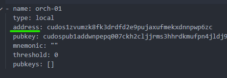

# Create a validator

To create a validator account, you need:
1. A running ethereum full node
2. A validator
3. An orchestrator
4. A gravity bridge

Only after finalizing previous steps, you can start the process of creating a validator and running it on your node. this section explains how to achieve each step in detail.

## Ethereum full node

You can use an existing full-node if you have or you can follow the procedure below in order to start one but do use Infura:
1. Run your ethereum binary on a different machine that your validator is running
2. Clone the [CudosBuilders](https://github.com/CudoVentures/cudos-builders) repository
3. Rename it to exactly _CudosBuilders_
4. Checkout the branch sdk-0.43 of the CudosBuilders repo:
```
cd CudosBuilders
git checkout sdk-0.43
```
5. open shell and navigate to _CudosBuilders/docker/ethereum_ directory
6. Execute the following command in order to start ethereum node
```
sudo docker-compose -f ./ethereum.yml -p ethereum up --build
```

You have to wait ~12 hours to finish syncing the Rinkeby test network. Its size is almost 70GB.

## Cosmos validator

To locate the containers' ID, that is needed to connect to its bash, run the following command in the terminal:
```
docker container ls
```
Copy the CONTAINER_ID and run the following command:
```
docker exec -it <container_id> bash
```

1. As a first step, you need to get the private key on your node. So, if you created the account by Keplr then just connect to the full nodes' container and run the following commands to add it to the node:
```
# The amount you want to stake, denominate them in acudos, without spaces (min 1 000 000 000 000 000 000 acudos) export
export STAKE="1acudos"
CHAIN_ID="cudos-testnet-public"

# Add the wallet in your nodes' keyring:
cudos-noded keys add validator --recover --keyring-backend="os"
```
2. Enter your mnemonic address for the account, your account should hold at least 1000000000000000000acudos (1 CUDOS).
3. Create a password, which will be used to lock the internal Keystore
4. Re-enter the password
5. You can change the rates as you desire for your validator
6. Create a validator by entering the password and running the following command:
```
cudos-noded tx staking create-validator --amount=$STAKE \
    --from=validator \
    --pubkey=$(cudos-noded tendermint show-validator) \
    --moniker=$MONIKER \
    --chain-id=$CHAIN_ID \
    --commission-rate="0.10" \
    --commission-max-rate="0.20" \
    --commission-max-change-rate="0.01" \
    --min-self-delegation="1" \
    --gas="auto" \
    --gas-prices="0.025acudos" \
    --gas-adjustment="1.80" \
    --keyring-backend="os" \
    -y
```
7. If you see the transaction hash without getting any error, then congrats you have successfully created a validator account.

Note that if you get a message that the transaction is not included in any block, please wait a few seconds and do not start another transaction. Be aware not to exit the docker shell. You will need it for the next step that is registering the Cosmos orchestrator.

## Cosmos orchestrator

The cosmos orchestrator is a program that runs on every validator beside the Cosmos code. Validators, running a chain with the Gravity module installed, use the cosmos orchestrator to sign messages or transactions with a validator's unique key.

### Get the validator address

After you have created a validator account, you must find your validator address by running the command:
```
cudos-noded q staking validators
```

the resulting output looks similar to:


Note that you must find your validator and copy its _operator_address_. You can refer to the moniker for finding your validator.

### Add the orchestrator wallet

Now you need to add another wallet that should have some CUDOS tokens to use for the orchestrator. You can achieve that by running the command:
```
cudos-noded keys add orchestrator --recover --keyring-backend="os"
```
The resulting output looks similar to the image below. You will need the address of this wallet and mnemonic for the next steps.


Note that after running the command above, you will need to enter both your mnemonic address for the account and the password which you have created on a previous step while adding the validator's wallet.

### Register orchestrator

1. Add the following variables:
```
export VALIDATOR_ADDRESS="<*operator_address* from above>"
export ORCH_ADDRESS="<*address* from the previous step>"
export ETH_ADDRESS="<eth address, starting with 0x, that have some ETH on rinkeby test network>"
```
2. Register the orchestrator:
```
cudos-noded tx gravity set-orchestrator-address $VALIDATOR_ADDRESS $ORCH_ADDRESS $ETH_ADDRESS --from validator --keyring-backend "os" --chain-id $CHAIN_ID
```

## Gravity bridge

1. Run your gravity bridge binary on the same machine that your validator is running
2. Clone the [CudosBuilders](https://github.com/CudoVentures/cudos-builders) and [CudosGravityBridge](https://github.com/CudoVentures/cosmos-gravity-bridge) repositories
3. Place them in the same directory
4. Rename them to exactly _CudosBuilders_ and _CudosGravityBridge_
5. Checkout sdk-0.43 branch of _CudosBuilders_ repo and cosmos-sdk-0.43 branch of _CudosGravityBridge_.
6. Open shell and navigate to _CudosBuilders/docker/orchestrator_ directory
7. Create a copy of orchestrator.env.example
8. Rename it to orchestrator.client.testnet.public01.env
9. Open orchestrator.client.testnet.public01.env in any editor and set all of the parameters.
10. Delete any comments from this file (delete # and everything after it):
```
ADDRESS_PREFIX="cudos" # ADDRESS_PREFIX must be exactly as here
FEES="<fee that you will have to pay for each bridge operation>" # format "100acudos"
GRPC="http://<ip of your cosmos node>:9090" # port should be 9090
ETHRPC="http://<ip of ethereum node>:8545" # port should be 8545
CONTRACT_ADDR="0x9fdE6D55dDa637806DbF016a03B6970613630333" # CONTRACT_ADDR must be exactly as here
COSMOS_ORCH_MNEMONIC="<mnemonic of your orchestrator account>"
ETH_PRIV_KEY_HEX="<private key of your eth wallet that was used to register the validator>" # in hex format without leading 0x
```
11. Finally run the orchestrator
```
sudo docker-compose --env-file ./orchestrator.client.testnet.private01.arg -f ./orchestrator.release.yml -p cudos-orchestrator-client-testnet-private-01-release up --build
```

### Send funds using the bridge

You have two different options to send funds (it is recommended to use the first option UI):
1. Using gravity bridge UI
2. Using the console

#### Using the gravity bridge UI (recommended option)

Open [Gravity Bridge](http://35.192.177.142:4000/). Then you can use [Kelpr](https://wallet.keplr.app/) and [Metamask](https://metamask.io/) for sending funds between the two blockchains.

#### Using the console (not recommended option)

1. Start docker shell once again, like you did when you have created your validator.
2. Connect to the orchestrator instance instead of the validator one.
3. Choose how you want to send funds eithrer from Ethereum to Cosmos or the opposite
4. Before sending funds to Ethereum please check the available balance in the smart contract on the address.
4. Send funds from Ethereum to Cosmos by running the command:
```
./gbt client eth-to-cosmos \
  --ethereum-key "<private key of the sender in hex without leading 0x>" \
  --gravity-contract-address "0x9fdE6D55dDa637806DbF016a03B6970613630333" \
  --amount <amount in CUDOS without ""> \ #example 0.0000000000000000001
  --destination "<destination cosmos address>" \
  --token-contract-address "0x28ea52f3ee46cac5a72f72e8b3a387c0291d586d" \
  --ethereum-rpc "http://<ip of your ethereum node>:8545"
```
5. Send funds from Cosmos to Ethereum by running the command:
```
./gbt --address-prefix="cudos" client cosmos-to-eth \
    --amount="<amount in acudos>" \ # example "1acudos"
    --cosmos-grpc="http://<ip of your cosmos node>:9090" \
    --cosmos-phrase="<mnemonic of sender>" \
    --eth-destination="<destination eth address>" \
    --fees="<fee that will be kept in the bridged>"
```

Note that The commands of sending funds takes up to few minutes to be executed.
