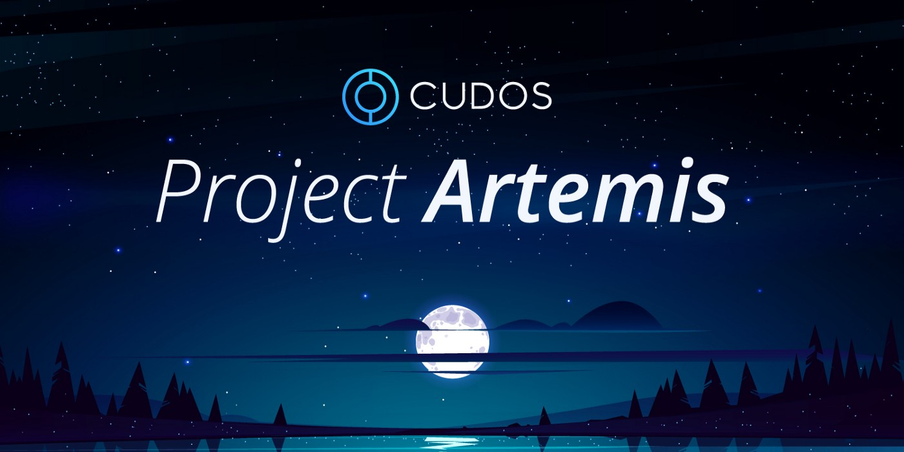

During the Cudos Public 'Somniorum' Testnet we will be running our incentive programme Project Artemis. We're inviting the Cudos community to help contribute towards the testing to help move the network closer to mainnet. To help maximise participation in our public testnet and to get the best feedback we're offering token rewards to users who join us and fulfil some key testing tasks.

During Project Artemis participants are able to earn CUDOS by completing tasks. Once our mainnet is deployed participants of Project Artemis will have native CUDOS sent to their wallets as reward for their contributions.

Tasks are broken down by user group; as either Validator tasks or Developer tasks. Anyone can participate on either side but Validator tasks require a much higher level of technical involvement and are only recommended for those with significant experience. Any Validators who're whitelisted for Mainnet and have already staked tokens via [CUDOS Staking](https://wallet.cudos.org/wallet) should be participating in each test phase, particularly Phase 4.

Project Artemis is broken down into 4 key phases which will run sequentially, find more details of each below:

## Testnet Phases

### Phase 1 - Apollo (finished October 22)

Starter setup tasks for Cudos Network onboarding for Validators and users, focussing on account creation, hardware provisioning, node syncing and the CUDOS faucet.

Total amount available per user:
- Validators: up to $360 each (plus $200 p/m for whitelisted mainnet Validators)
- Developers: up to $36 each

#### Validator Tasks

|**Task ID**|**Description**|**Resources**|**$ Reward**|
| - | - | - | - |
|`ARTEMIS-APOLLO#1`|Setup a Cudos Validator|[Docs](/build/validator.html)|10|
|`ARTEMIS-APOLLO#2`|Add a Sentry Node to your Cudos Validator for additional security|[Docs](/build/validator.html#run-a-sentry-node)|5|
|`ARTEMIS-APOLLO#3`|Add Prometheus monitoring to the Validator Node|[Docs](https://prometheus.io/docs/prometheus/latest/getting_started/)|-|
|`ARTEMIS-APOLLO#4`|Create a Grafana dashboard to show `ARTEMIS-APOLLO#3` Prometheus data/sending Validator data monthly to Cudo Network|[Docs](https://prometheus.io/docs/visualization/grafana/)|100|
|`ARTEMIS-APOLLO#6`|Write a unique blog post setting up a Validator Node (in any language of your choice)|n/a|30|
|`ARTEMIS-APOLLO#8`|Maintain an 80% uptime for the remaining Phase 1|n/a|200 p/m*|
|`ARTEMIS-APOLLO#14`|Stake more than the minimum CUDOS to become a Validator|n/a|-|
|`ARTEMIS-APOLLO#15`|Receive delegated staking and receive a commission on delegated tokens to your Validator|n/a|-|
|`ARTEMIS-APOLLO#16`|Complete `ARTEMIS-APOLLO#14`, `ARTEMIS-APOLLO#15`, then unstake part of your excess staked CUDOS tokens|n/a|15|
|`ARTEMIS-APOLLO#18`|Validator task list completion bonus|n/a|200|

#### Developer Tasks

|**Task ID**|**Description**|**Resources**|**$ Reward**|
| - | - | - | - |
|`ARTEMIS-APOLLO#5`|Setup a Cudos Wallet and redeem Somniorum CUDOS from the Faucet|[Docs](/build/account-setup.html)|10|
|`ARTEMIS-APOLLO#7`|Join our community [Telegram](https://t.me/cudostelegram), [Discord](https://discord.com/invite/NUmUXEmvBn), and follow CUDOS on [Twitter](https://twitter.com/CUDOS_)|n/a|1|
|`ARTEMIS-APOLLO#9`|Run a full Cudos Node to connect to the network|[Docs](/build/developers-setup.html#initialize-and-start-full-node)|10|
|`ARTEMIS-APOLLO#10`|Send tokens to another wallet using the Keplr extension|[Docs](/build/interact-keplr-explorer.html#send-tokens-to-another-wallet)|-|
|`ARTEMIS-APOLLO#11`|Delegate tokens to at least 3 different Validators using the Cudos Explorer|[Docs](/build/interact-keplr-explorer.html#delegate-tokens-to-a-validator-using-cudos-explorer)|-|
|`ARTEMIS-APOLLO#12`|Claim CUDOS staking rewards using the Cudos Explorer|[Docs](/build/interact-keplr-explorer.html#claim-rewards-using-cudos-explorer)|-|
|`ARTEMIS-APOLLO#13`|Complete `ARTEMIS-APOLLO#10`, `ARTEMIS-APOLLO#11`, `ARTEMIS-APOLLO#12`, then unstake CUDOS tokens using the explorer|[Docs](/build/interact-keplr-explorer.html#unstake-tokens-using-cudos-explorer)|10|
|`ARTEMIS-APOLLO#17`|Complete 5 unique transaction types (Developer completion bonus)|n/a|5|

Results will be shared very soon -- stay tuned!

### Phase 2 - Buzz

Next stage in our public testing of the network, covering all aspects of Validation, including staking, delegated staking and rewards.
Additionally, also testing CosmWasm smart contracts, including contract interaction, contract deployment and contract interfaces, as well as Gravity bridge implementation with Rinkeby Ethereum and a network upgrade.

Total amount available per user:
- Validators: up to $60 (plus $200 p/m for whitelisted mainnet Validators)
- Developers: up to $65

The date and time for the network upgrade will communicated shortly, please keep an eye on our [communication channels](/#help-and-support).

#### Validator Tasks

|**Task ID**|**Description**|**Resources**|**$ Reward**|
| - | - | - | - |
|`ARTEMIS-BUZZ#4`|Vote on a governance proposal that gets accepted|[Docs](/learn/#proposals.html)|5|
|`ARTEMIS-BUZZ#5`|Change your validator fee|[Docs](/build/validator.html#how-to-change-your-validator-fee)|5|
|`ARTEMIS-BUZZ#6`|Participate successfully in the network upgrade|[Docs](/build/upgrade-v0.3.html)|20|
|`ARTEMIS-BUZZ#7`|Maintain an uptime record of at least 80%|n/a|200 p/m*|

#### Developer Tasks

|**Task ID**|**Description**|**Resources**|**$ Reward**|
| - | - | - | - |
|`ARTEMIS-BUZZ#1`| Deploy a cosmwasm example smart contract (*e.g.* cw20) | [Docs](/build/smart-contracts.html#smart-contracts) |-|
|`ARTEMIS-BUZZ#2`| Complete `ARTEMIS-BUZZ#1` and then interact with your deployed smart contract (*e.g.* send tokens between wallets) | [Docs](/build/smart-contracts.html#examples-of-interaction) |10|
|`ARTEMIS-BUZZ#3`| Via the Gravity Bridge, transfer CUDOS tokens from Cudos to Ethereum and vice-versa | [Docs](/build/validator.html#using-the-gravity-bridge-ui-recommended-option) |5|
|**`ARTEMIS-BUZZ#11`**| **Mint an NFT** | [Docs](/build/nft.html#minting-a-new-nft) |**10**|
|**`ARTEMIS-BUZZ#12`**| **Send an NFT to another wallet** | [Docs](/build/nft.html#sending-an-nft-to-another-wallet) |**5**|
|`ARTEMIS-BUZZ#10`| Developer task list completion bonus |n/a|20|

#### All Users

|**Task ID**|**Description**|**Resources**|**$ Reward**|
| - | - | - | - |
|`ARTEMIS-BUZZ#8`| Create a quality Youtube video showcasing an aspect of the testnet |n/a|20|
|`ARTEMIS-BUZZ#9`| Write a quality blog on deploying a smart contract on Cudos |n/a|10|

### Phase 3 - Armstrong (Launching Soon)

Adversarial stress tests bringing a coordinated strike to bring as much diversity in transaction activity as possible to the Cudos Network. Validators will run network load and performing maintenance tasks.

Total amount available per user:
- Validator = $n + $p/m
- Developer = $n

|**Task ID**|**Description**|**Resources**|**$ Reward**|
| - | - | - | - |
|`ARTEMIS-ARMSTRONG#1`| 🌎 | 🚀 | 🌝 |

### Phase 4 - Collins (Launching Soon)

Migration testing to performa a dry-run of our genesis and token migration plan for the new native Cudos Network.

Total amount available per Validator = $n + $p/m

|**Task ID**|**Description**|**Resources**|**Reward**|
| - | - | - | - |
|`ARTEMIS-COLLINS#1`| 🌎 | 🚀 | 🌝 |

## How to Participate

Just head to the current [active tasks](#phase-2-buzz) and dive into the Somniorum Testnet.

Upon completion of each task please submit your evidence to [this form](https://docs.google.com/forms/d/e/1FAIpQLSfKPRDGuAE8msXVfaH-wwMw7gw4NyTeEBXHuPzuWdH9LlfE4A/viewform). Tasks will be monitored and validated on-chain for completion.

## CUDOS Rewards

CUDOS tokens will be distributed to the top Project Artemis participants when the Cudos Network mainnet is deployed. The same wallet addresses used for testnet **must** be retained to ensure access to your funds.

Participation in Project Artemis is open to everyone, but only the top 300 Developer addresses and 100 Validator addresses will be eligible for rewards. Details of which users have contributed the most and qualified for CUDOS rewards will be revealed shortly after each phase concludes.

We will be using blockchain snapshots to validate the state of tasks on-chain, and manual verification for any 'off-chain' tasks. We reserve the right to decide all reward eligibility.
