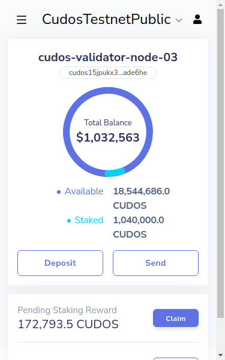

## Validator Rewards

Validators play a unique role in the Cudos Network’s day-to-day workings. They accept transactions, validate blocks, and interact with other stakeholders in various Governance votes that ensure the network’s security, integrity and viability.

As part of that, Validators run and execute smart contracts, which are one of the key aspects of the network, and coordinate the triggering and execution of computing workloads. Thus, the network’s health depends on Validators availability and performance and the early identification of any dangerous and harmful behaviours.

Validators earn several types of standard rewards, apart from one-off additional ones:

* They earn Staking Rewards to incentivise their crypto-economic contributions to the network over time.
* They earn a commission on the stake delegated through them, as part of the delegated proof of stake mechanism, from any users who do not run infrastructure for the network but want to support it.
* They earn gas fees.

After the mainnet is launched and the network gains traction, staking rewards will become a secondary source of revenue, and network fees will become the main one.

### Mainnet validators

Once we deploy the Cudos Network mainnet, Validators (and stakers) staked in Ethereum will be migrated from Ethereum Staking to full PoS staking in the network. The balances will be converted to the native CUDOS token, and Validators will begin processing blocks for the network. At this point, Validators will need to be running Cudos nodes with appropriate hardware to maintain the network and validate transactions.

Cudos is also finalising the architecture of the compute capabilities of the network. We will soon communicate how the compute offering will integrate into the network, and any additional hardware requirements for running compute jobs.

The Cudos Network penalises adverse behaviours, and the node operators or Validators linked to these automatically to incentivise the highest level of security, availability, and economic integrity. The types of penalties a Validator can incur on the network have several levels of severity. Some may lead to immediate, irreversible exclusion. Others may lead to time-outs from additional Staking rewards. Cudos as a team is working to ensure that these metrics are real-time and accurately predictive to guarantee that we only offer the highest quality of computing power on our network.

## Validator Staking Instructions

The process to add or remove stake as a Validator is completely analogous to the delegation one described in the [delegation page](/build/interact-keplr-explorer.html#delegate-tokens-to-a-validator-using-cudos-explorer), but using the Validator's wallet.

###  Add stake to my Validator

1. Connect your Validator wallet into the explorer, and navigate to your own Validator's page

2. Click **DELEGATE** and introduce the amount you wish to stake in order to increase your Validator's share

3. Click **Next** and approve the transaction in Keplr to increase your Validator's stake.

### Move part of my stake from my Validator to a different Validator

The same process as above, but clicking the **REDELEGATE** button instead and selecting the new Validator which should receive the staked tokens.

### Remove stake from my Validator

Same process again, but clicking the **UNDELEGATE** button.
Please keep in mind that

- A Validator needs a minimum amount staked (1 CUDOS for testnet, 2,000,000 CUDOS for mainnet).
- There is a 21-day unbonding period between token undelegation and the tokens being usable in your wallet, for security reasons.

### Claiming rewards

In order to claim pending rewards with your validator, simply

1. Open your Keplr wallet and click the **Claim** button

2. Approve the transaction, and wait for it to be processed.

## Delegator Rewards

The Cudos network will support delegated staking through the Validators. The Validators earn a proportion of the rewards of the users who delegated the staked through them. Each Validator can freely choose the fee. However, it will always need to be above a predefined minimum value set for security reasons. This minimum will be 2% at the start.

Any user with CUDOS tokens, including Validators, can delegate their stake through a Validator. One wallet can delegate the stake to more than one Validator.

All staking participants earn rewards individually based on their staked amount. Each staking participant receives the percentage of the rewards proportional to the percentage of the total stake they own. For example, if a total of 500 tokens are staked by users, and if one of the users staked 50 tokens, then this user gets 50/500 = 10% of the total rewards being distributed (excluding commissions).

Rather than staking all tokens in a Validator hosted by the project, Cudos will stake some tokens delegating them to other Validators in the network. This will enhance the revenue streams for these Validators further. We will share more details on this shortly, but expect the project to delegate an amount similar to the minimum stake for a Validator.

### Delegated staking

#### What is delegated staking

Recently, most networks that require the nodes to stake also allow delegated staking. The concept is completely analogous: the nodes of the network stake a certain amount of tokens in order to qualify to be a node, and get rewarded accordingly. For users willing to stake tokens but not necessarily wanting to host a full node, there is the possibility to stake in one of the aforementioned nodes, in order to support it and the network. This is what is commonly understood by delegated staking, and also gives rewards for the contribution.

#### How to stake via a validator

<!-- TODO: rewrite this section with full step-by-step on how to add, remove stake via the Explorer and claim rewards -->

In order to delegate your stake via a validator you will need the funds you want to delegate and to decide to which validator node you want to delegate the stake to. Once that is done, you can either follow the process for a staking provider, or the instructions that we will be updating on this page soon.

#### Staking pool and provider fees

While all staking rewards are the same, the final amount for users delegating their stake will likely be lower, as the staking providers keep a percentage of the staking rewards that result from tokens delegated to them. This percentage will be choosable by each staking provider, and thus might vary from one to another.

#### Which staking providers can you choose

There are currently multiple staking providers that are coming onboard, and there will be a diversity of offerings by launch time. A list will be published soon. If you are interested in becoming a staking provider for CUDOS, [apply here](https://www.cudos.org/#contact-us).
