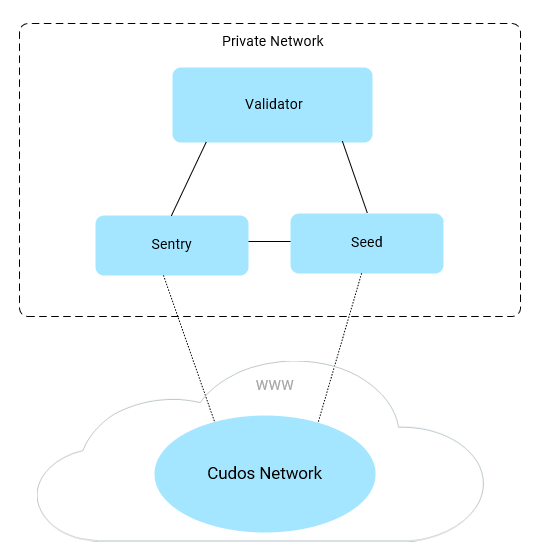

## Validators Overview

Cudos Validators run node software to operate the Cudos Network blockchain by checking incoming transactions and forming new blocks in a decentralised manner. These validators participate in the consensus protocol by broadcasting votes which contain cryptographic signatures signed by each validator's private key.

Cudos Network is a Proof of Stake chain so each Validator must put up a CUDOS token deposit as collateral to participate. Validators can have CUDOS delegated to their node by other token holders, they can also set commission on the fees their delegators receive as additional incentive.

<!---The Validator pool is currently permissioned to allow the network to launch from testnet with stability, this will fully open once the network is deployed to mainnet. The active Validators on the network are determined by who has the most stake delegated to them — the top 100 Validator candidates with the most stake will become Cudos Network Validators.--->

Validators have a responsibility to be able to constantly run a correct version of the software, meaning their servers are always online and their private keys are not compromised. They also have a duty to participate in governance to ensure the decentralised decision making of the Cudos Network.

<!---### Become A Validator

If you are interested in becoming an early Cudos Validator during the testnet please get in touch with us using [this application form](https://www.cudos.org/#contact-us).

If you're already on the whitelist and looking to get setup on your hardware with a Validator Node please visit our [build docs](/build/validator.html)
--->

## Node Types

### Full Node
All Cudos nodes run the `cudos-noded` software, and are initially built as Full nodes. Once synced, the Full node holds and maintains a copy of the full state of the blockchain and propagates blocks and transactions, but does not validate them. A node can either remain as a Full node only, or can take on one of the roles described in the following sections, according to how they are configured. 

### Validator Cluster Nodes
The Validator Cluster is a cluster of Full Cudos nodes that can be configured with *Validator*, *Seed*, or *Sentry* roles. A validator cluster must consist of at least one Validator Node and one Sentry Node. Seed nodes are recommended but not mandatory. The cluster can contain many of each node type for High Availability and scaling. 

::: warning Note:
For security reasons, Cudos Seed and Sentry nodes are configured to reject connections from multiple peers with the same IP address. **Therefore each seed and sentry must have its own public IP address.**
:::

  

<b><i>Validator Cluster</i></b>

A Full Node in a cluster can be configured with one of the following roles: 

**Validator (protected)** A validator is protected if the Seed and Sentry nodes are configured to hide its ID from the external Cudos network. Assuming it has the minimum required stake, the validator will assist with consensus activities on the Cudos network; voting on the validity of new blocks, and if chosen, creating new blocks themselves. The validator will also take part in governance decisions. The protected Validator has no direct connections to the outside Cudos network, instead it communicates at the application layer with the Sentry Node which in turn communicates with the Cudos network. If a Seed node is present, it will inform The Validator about other nodes on the Cudos network. 

**Seed node**  A seed node generates a list of peers to which another node can connect, so you can think of a seed node as the first point of contact for a new node joining the network. The seed node proactively learns about nodes on the external Cudos network by a process of ‘crawling’ whereby it connects to other nodes, learns their address book, then disconnects and repeats the process. The seed node is not a mandatory requirement for a Validator Cluster, as the Sentry can locate other nodes on the Cudos network.

**Sentry node**  The Sentry node is an application layer proxy for the validator nodes. Any communication the Validator or Full Node has with the outside Cudos network consists of application messages to/from the Sentry node, which then relays messages to/from nodes on the Cudos network. If a Seed Node is not present, the Sentry will be responsible for informing the validator about nodes on the external Cudos network.

### Standalone Nodes

#### Standalone Full Node

A standalone Full Node is a quick way to test your NFTs and smart contracts against the Cudos blockchain. Once synced, the Full node holds and maintains a copy of the full state of the blockchain and propagates blocks and transactions, but does not validate them.
The standalone full node has the addresses of 3 Seed nodes preconfigured, which enable the new node to bootstrap onto the Cudos network. It will use these Seed nodes to find other nodes and sync with the blockchain.

#### Standalone Validator
The Standalone Validator is a Standalone Full Node acting as a validator. Assuming it has the minimum required stake, the validator will assist with consensus activities on the Cudos network; voting on the validity of new blocks, and if chosen, creating new blocks. The validator will also take part in governance decisions. 

## Validator Mechanics

After a Validator is setup and officially added to the Cudos Network with a `create-validator` transaction, they can be in three states:

- `in validator set`: Validator is in the active set and participates in consensus. Validator is earning rewards and can be slashed for misbehaviour.
- `jailed`: Validator misbehaved and is in jail, i.e. outside of the validator set. If the jailing is due to being offline for too long, the validator can send an `unjail` transaction in order to re-enter the validator set. If the jailing is due to double signing, the validator cannot unjail.
- `unbonded`: Validator is not in the active set, and therefore not signing blocs. Validator cannot be slashed, and does not earn any reward. It is still possible to delegate Atoms to this validator. Un-delegating from an unbonded validator is immediate.

### Staking

Validators need to stake 2,000,000 CUDOS when they connect to the Cudos Network in order to become eligible for transaction processing and rewards. Validators can also delegate additional CUDOS stake on top of the minimum threshold to earn an additional cut of available rewards.

Validators and their Delegators earn CUDOS as staking rewards for their support to the network security. These reward percentages will depend on the number of Validators and users delegating their stake in the network: the more staking there is, the lower the staking rewards for all participants will be as the total amount to distribute over a 10 year period is fixed.

When a Validator or a Delegator wants to retrieve part or all of their staked CUDOS, they send an `unbonding` transaction directly (or via the Explorer). Unbonding CUDOS undergo a 21 day unbonding period during which they are liable to being slashed for potential misbehaviours committed by the Validator before the unbonding process started, this ensures no-one can withdraw their secure stake immediately after commiting a slashable offence.

If a Validator misbehaves, a certain portion of their total stake is slashed meaning that every Delegator that staked CUDOS to this Validator gets penalised in proportion to their amount staked. Delegators are therefore incentivised to delegate to Validators that they anticipate will function safely.

### Transaction Fees / Gas

Validators and their Delegators earn CUDOS used in the network as gas. Each transaction costs gas for execution of computational tasks on the network, which is then paid to the Validators for running these jobs and helping secure the operation of the Cudos Network.

### Slashing

Slashing incentivises network participants to act in the interests of the Cudos Network rather than their own self interest and is the main game theoretic mechanism to secure a proof of stake system. If a Validator misbehaves, their delegated stake will be partially slashed.

If validators double sign, are frequently offline or do not participate in governance, their staked CUDOS (including CUDOS of users that delegated to them) can be slashed, and the Validator will be jailed.
The penalty depends on the severity of the violation.
For a validator to be unjailed, it needs to issue an `unjail` command

There are currently two faults that can result in slashing of funds for a Validator and their respective Delegators:

- Double signing: If someone reports on chain A that a validator signed two blocks at the same height on chain A and chain B, and if chain A and chain B share a common ancestor, then this validator will get slashed by 5% on chain A.
- Downtime: If a validator misses more than 95% of the last 10.000 blocks, they will get slashed by 0.01%.

In the Cudos Network, slashed tokens go to the community CUDOS Treasury. That way, participants that misbehave who would seek to harm the network will compensate the damage done to the whole community, by contributing to its maintenance and growth.
