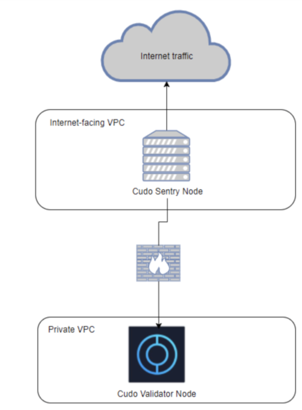

# Securing your nodes

Setting up a Cudos Node is the starting point for any user wanting to interact with, and play a greater part in, the network. In order to set up a Cudos node, users will require the use of Go/Golang version 1.15 or higher. On-premise or bare metal server providers such as OVH, Leaseweb, IBM, Alibaba, Amazon Web Services, Google Cloud Computing platform, or Microsoft Azure, can be used to generate Cudos nodes and join the Cudos Network.

Once the appropriate hardware and software requirements are met, users will then need to install the Cudos Network’s high-performance compute blockchain through version control systems such as Github or use the network’s release tags and build from source. The Cudos Network application is the application that defines the Cudos Network and its special purpose compute workflows.

This application consists of a Cudos Network daemon and command-line interface that, once deployed, runs a full-node version of the Cudos Network blockchain for users to interact with. This bespoke implementation supports innovations such as Inter-Blockchain Communication (IBC) protocol to guarantee high levels of reliability and cross-chain interactions inspired by the network’s computing capabilities. This Cudos Network blockchain additionally leverages the most vetted modules within the Cudos community such as staking, authentication, and governance logic. It also includes special blockchain components and developer toolchains linked to its unique set of high-performance compute use cases and development workflows.

## Validator node security

Cudos Validating nodes are Cosmos SDK-specified full nodes. This allows for a heavier-duty set of transaction processing workflows and network-level security exchanges with other members of the network. When setting up a Cudos Network Validator node, Validators will have to decide whether they want to be fully responsible for Key Management or if they want to leverage third-party infrastructure to do so. The Cudos Network blockchain leverages the Tendermint Key Management System in order to ensure high availability access to signing keys as part of the Cudos Network’s block processing workflows. This additionally allows this blockchain to prevent double-signing events. In practice, this feature allows for the tamper-proof storage of Hardware Security Module (HSM) Validator keys, even if the host has been compromised. If choosing to implement an HSM, the Validator should review that HSM's documentation in conjunction with the Tendermint KMS requirements, to ensure suitable compatibility before finalising a choice about this part of the security architecture.

An additional security and availability consideration is the use of one or more sentry nodes between a Validator node and the public internet. This mechanism is used to place a layer of separation between the security-sensitive Validator node, and would-be sources of attack.

Such attack types can include things like traffic-volume-based distributed denial-of-service (DDoS) attacks, designed to starve the Validator of available bandwidth in servicing legitimate usage, as well as malformed/spam message attacks, intended to consume processing or storage resources on the Validator, or induce unintended behaviour.

We currently recommend the use of one sentry node whose exterior faces the public internet, with its interior attached to a private internal network. The Validator node then is connected solely to the private internal network, therefore allowing the proxying of all requests to and from the Validator via the sentry. Additionally, we recommend that the sentry's internet connection is further protected by a provider-managed firewall and DDoS-mitigation service.

As previously indicated in the node minimum hardware requirements, our favoured recommendation is to implement discrete physical servers for the Validator and sentry. Using that specification, the separation of public internet and private internal network may be achieved either through physically separated interfaces, or a VLAN-based configuration.

It is technically possible to use a hypervisor on a single physical server, with system VMs for each of the Validator and sentry roles, and to use virtual networking to create the recommended security topology. We do not discourage this approach, but do strongly recommend a thorough understanding of the prospective security and performance considerations prior to implementation.

An extension of the sentry node architecture optionally sees a Validator operator adding additional sentries. For those concerned about risks such as DDoS attacks consuming all bandwidth into the single recommended sentry, it is possible to add further sentries, optionally across multiple discrete geographies with independent internet connections. The private internal network for connection between sentries and the Validator would then need to be stretched out to these.

Beyond the set up of a server, a node, an authenticated way of joining the Cudos blockchain using our in-built public key infrastructure, in coordination with Ledger HSM or YubiHSM for those Validators choosing to implement them, the use of full nodes when interacting the network is highly recommended. We plan to implement the ability for Cudos Validator Nodes to store a history of previously signed blocks in order to more seamlessly prevent double-signing by adverse or deficient nodes in the Cudos Network. This feature is currently absent in earlier-generation Tendermint blockchains. The final element keeping Cudos Network Validating nodes safe is the Tendermint Core Byzantine Fault Tolerant Proof of Stake consensus algorithm.

## Ports

Nodes use the following tcp ports:

- 1317: API port.
- 9090: gRPC port.
- 26656: P2P port used by transferring internal data between nodes.
- 26657: Tendermint RPC server. Reference: https://docs.tendermint.com/master/rpc/
- 26660: Port for Prometheus monitoring.

Full/Seed nodes use the following ports: 26656, 26657, 26660.

Sentry nodes use the following ports: 1317, 9090, 26656, 26657, 26660.
