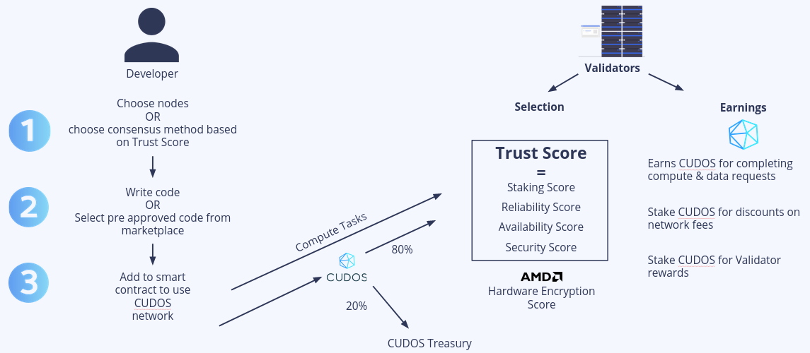

# Treasury

## What is the treasury

The CUDOS treasury is a pot of tokens that are used to incentivise the network and help it grow. The treasury has two main sources of income: 20% of the CUDOS paid for transactions requested through the CUDOS smart contracts, and tokens that get slashed from participants due to malicious behaviour. 

These tokens will be used mainly for:
- Staking rewards
- Development foundation
- Development grants
- Shared with developers of marketplace templates

This will help incentivise developers and the whole ecosystem. For instance, developers will be rewarded for creating apps for the [CUDOS marketplace](/marketplace), for the CUDOS smart contracts to use.

Similarly, treasury funds will also be used to [give developers and participants grants](/foundation-and-grants), in order to enable new functionality in the network, to improve it, to propose changes, etc.